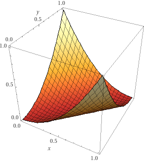
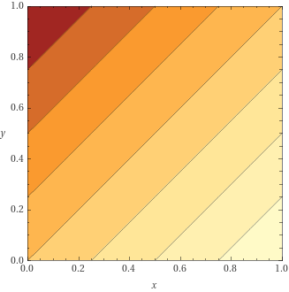
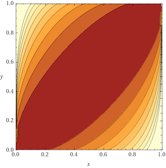
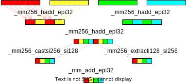

# NNUE 神经网络

## 前言

本文档包含的内容如下：

- 技术内容
- 对NNUE及其原理的详细描述
- 线性代数的快速复习
- 输入定义和因子分解
- 适用于NNUE网络的组件（层）
- 推理代码和优化
- 量化数学和实现
- 几乎是生产就绪的优化代码
- PyTorch训练器实现（+重要的CUDA内核）
- 架构考虑和历史

本文档不包含的内容：

- 训练网络的教程（请参阅[维基](https://github.com/glinscott/nnue-pytorch/wiki)）
- 数据集、优化器和超参数
- 实验结果日志

> 首先，我们需要了解什么是NNUE。NNUE（Efficiently Updatable Neural Network，高效可更新神经网络）是一种特殊的神经网络结构，它可以在不影响性能的情况下快速更新。这使得NNUE在一些特定场景下表现出色，例如在棋类游戏中。
>
> 接下来，我们会简要回顾一下线性代数的基本概念。线性代数是研究向量、矩阵和线性方程组的数学分支。在神经网络中，我们经常需要处理这些概念，因为它们是神经网络计算的基础。
>
> 为了让神经网络能够处理各种输入数据，我们需要定义输入并进行因子分解。这意味着我们需要把输入数据转换成适合神经网络处理的形式。在NNUE中，我们会使用不同的层（组件）来处理这些输入数据。
>
> 神经网络的运作过程称为推理，而为了提高推理速度，我们会对代码进行优化。这包括了对神经网络中的计算进行简化并使用一些高效的算法。
>
> 量化是一种将神经网络中的权重和激活值转换为较小的数据类型（如整数）的方法，以减少计算资源和存储需求。这对于在资源受限的设备上运行神经网络非常有用。
>
> 为了让神经网络在实际应用中表现良好，我们需要对代码进行优化。这意味着我们需要找到一种方法来提高神经网络的性能，同时保持准确性。在这里，我们会使用PyTorch这个深度学习框架来实现训练器，并利用CUDA内核来加速计算。
>
> 最后，我们将讨论NNUE的架构和发展历史。这将帮助我们了解NNUE是如何从最初的想法发展成为现在这个强大的神经网络结构的。
>
> 需要注意的是，本文档并不包含训练网络的教程、数据集、优化器和超参数等内容。如果您想了解更多关于这些方面的信息，请参阅我们提供的维基链接。

## 目录

[TOC]

## 基础知识

### 什么是NNUE？

NNUE（ƎUИИ 高效可更新神经网络）广义上来说，是一种神经网络结构，它利用了在连续评估之间网络输入的最小变化。它最早是为日本象棋（Shogi）发明的，由 [Yu Nasu ](https://www.chessprogramming.org/Yu_Nasu)设计，2018年5月被 Motohiro Isozaki 整合到 [YaneuraOu](https://github.com/yaneurao/YaneuraOu) 中，后来在2019年6月被 Hisayori Noda 移植到国际象棋引擎Stockfish中，但它也适用于许多其他棋盘游戏，甚至可能在其他领域也有应用。NNUE遵循以下原则：

1. 网络应该具有相对较少的非零输入。
2. 在连续评估之间，输入应尽量保持不变。
3. 网络应该足够简单，以便在整数领域进行低精度推理。

遵循第一个原则意味着当网络规模扩大时，输入必须变得稀疏。当前最佳的架构输入稀疏度约为0.1%。非零输入的少量限制了在必须对整个网络进行评估的情况下所需的评估时间上限。这是NNUE网络在保持较大规模的同时，仍能快速评估的主要原因。

遵循第二个原则（前提是遵循第一个原则）为有效更新网络（或至少其中一个成本较高的部分）提供了一种方法，而不是重新评估整个网络。这利用了一个事实，即单次移动只会稍微改变棋盘状态。这比第一个原则的重要性要低，对于实现来说完全是可选的，但对于那些愿意利用这一点的实现，它确实带来了可衡量的改进。

遵循第三个原则可以在常见硬件上实现最大性能，并使模型特别适合于传统国际象棋引擎所需的低延迟CPU推理。

总的来说，NNUE原则也适用于昂贵的深度网络，但它在快速的浅层网络中表现得更好，这些网络适用于低延迟的CPU推理，而无需批处理和加速器。目标性能是每秒每线程百万次评估。这是一个极端的用例，需要极端的解决方案，最重要的是**量化**。

#### 关于量化101和其重要性的解读

量化，这是一个将神经网络模型从浮点数领域转换为整数领域的过程。你可以想象成将一个连续的值变为离散的值。NNUE网络（这是一种神经网络的类型，专门为快速低精度整数运算而设计）就是通过这种方式来充分利用现代CPU的int8/int16（这些都是计算机语言中表达整数的一种形式）性能的。而浮点数对于达到最大的引擎强度并不是一个好选择，因为它为了获得相对较小的精度提升而牺牲了过多的运算速度（尽管由于其简单性，有些引擎会选择使用浮点数表示）。虽然量化过程中不可避免地会引入一些误差，这些误差在网络层次较深的情况下会累积得更多，但在相对较浅的NNUE网络中，这种误差可以忽略不计。我们将在后面的文档中更详细地描述量化。在此之前，本文档将使用浮点数而非整数，直到我们实际进行代码优化时，这才会变得重要。这段插入的目的是让读者意识到NNUE的最终目标，因为这是塑造NNUE模型并决定其可能性的最大因素。

> "101"是美国大学中用来表示基础入门课程的一种常见编号，如"经济学101"、"心理学101"等。因此，"量化101"指的是对于量化技术的基础入门教学或介绍。

### NNUE中哪些层级是有用的？

NNUE主要依赖那些可以在低精度环境中通过简单的算术运算实现的简单层级。这就意味着线性层（全连接，基本上就是矩阵乘法）和ClippedReLU层（将数值范围限制在0和1之间）特别适合它。池化层（进行乘法、平均、最大值运算）或者更复杂的激活函数（比如sigmoid）的近似表示也是适合的，但并不常用。

通常这类网络被设计得较为浅层（2-4层），因为大部分的知识都被保留在了第一层（这一层利用输入的稀疏性来保持高效）。在第一层之后，网络需要显著减小它的宽度（也就是每层的神经元数量）。如果网络后部的深层部分深度过大，其优势将被大型第一层的影响所主导，为了维持性能需求，网络的宽度需要降低。

> 在神经网络中，输入的稀疏性通常指的是输入数据中大部分元素（例如像素、特征等）的值为零或接近零的情况。这种情况在很多类型的数据中都很常见，例如自然语言处理中的词袋模型，图像处理中的黑白图像等。这种稀疏性有两个主要的影响：
>
> 1. **计算效率**：如果输入数据是稀疏的，那么在计算过程中，我们可以利用这种稀疏性来提高计算效率。例如，我们可以只对非零元素进行计算，或者使用专门为稀疏数据设计的数据结构和算法。
> 2. **模型复杂性**：在某些情况下，输入的稀疏性可能会增加模型的复杂性。例如，在自然语言处理中，如果我们使用词袋模型表示文本，那么由于大部分词语在大部分文档中都不会出现，所以输入向量会非常稀疏，这会导致模型需要处理的特征数量大大增加。
>
> 因此，对于稀疏输入，我们需要采取特殊的方法来处理，例如使用稀疏表示、设计适应稀疏性的模型结构，或者使用压缩、降维等方法来减少稀疏性。

#### 线性层

线性层（全连接层）其实就是一个简单的矩阵乘法。这种层可以高效地实现，支持稀疏的输入，同时具有良好的处理能力。它接受`in_features`个值作为输入，产生`out_features`个值作为输出。其运算过程可以被表示为`y = Ax+b`，其中：

`x` - 是尺寸为`in_features`的输入列向量

`A` - 是尺寸为`(out_features, in_features)`的权重矩阵

`b` - 是尺寸为`out_features`的偏置列向量

`y` - 是尺寸为`out_features`的输出列向量

这里的矩阵和向量，你可以想象成一个大表格和一个小列表。大表格（权重矩阵）存储了如何从输入信息提取特征的规则，小列表（偏置列向量）则是用来对每个特征进行微调。在这个过程中，输入信息（输入列向量）会按照这些规则被转换成输出信息（输出列向量）。


#### 线性层处理稀疏输入

`Ax`这个乘法运算可以从概念上简化为"如果`x[i]`不为零，那么就取`A`的第`i`列，将其乘以`x[i]`，并加到结果中"。现在，我们可以明显看到，每当输入中的元素为零时，我们都可以跳过处理权重矩阵的整行。这意味着我们只需要处理`A`中的列数，这个列数与输入向量中非零值的数量相同。即使权重矩阵可能有几万列，但对于每个位置，我们只关心其中的几列！这就是为什么第一层可以如此庞大的原因。


#### Clipped ReLU 层

这是一种基于普通ReLU的激活函数，其不同之处在于它上下都有界限。公式是`y = min(max(x, 0), 1)`。


这一层的目的是为网络添加非线性。如果只有线性层，它们可以全部合并为一层，因为矩阵可以直接相乘。

理想情况下，ClippedReLU将被ReLU替代，但是激进的量化需要减小隐藏层输入的动态范围，所以将值上限设为1对性能至关重要。

#### Sigmoid

这是一个激活函数，与[截断]的ReLU相反，它是平滑的。公式是`y = 1/(1+e^-kx)`，其中k是一个参数，决定了曲线的"拉伸"程度。


与截断ReLU相比，它有两个主要差异：

1. sigmoid是平滑的，也就是说它在所有地方都可以求导，这意味着不存在梯度消失的情况。
2. sigmoid是非线性的，输出趋于0或1，但永远不会达到。

虽然这个函数通常允许网络学习得比ReLU更多，但它的计算成本高，不适合在整数领域进行评估。然而，它是改进的一个好起点...

#### Quantmoid4

由于sigmoid函数的计算成本过高，我们需要寻找替代方案。一种替代方案是使用近似函数。恰好，`sigmoid(4x)`（以特定方式缩放到整数领域）可以被一个简单的分段二次函数很好地近似，这个函数只需要加法、乘法和位移运算。因为这个近似函数的主要目的是直接用在量化实现中，我们将介绍一个特定的变种，该变种的输出值范围在`[0, 126]`（并相应地缩放输入）。选择上界为126的原因是这是最大的偶数8位整数，我们希望得到一个偶数，以便在`x=0`时，值恰好在中间。公式如下：


注意，对于正`x`和负`x`，方程几乎是相同的。这种相似性即使存在两种情况，也可以实现无分支的实现。

结果图形如下（附上缩放的sigmoid(4x)进行比较）：


缺点是失去了平滑性，并且输出很早就四舍五入到0/1。但实际上，这并不是问题，这种"四舍五入"的实际误差可以忽略不计。

一旦我们实现和优化它，会有更酷的事情发生，所以我们将在优化的量化实现部分再回到这一层。

#### 池化层

1. 有时我们希望降低输入的维度，以使层的大小更容易处理。例如，我们可能会倾向于使用`512->16`的层，而不是使用一个非常窄的输出的`1024->8`层。池化层通过降低维度，提供了一定的灵活性。

   池化层的工作方式是在输入的不重叠范围上应用函数`F`，其中`F`的输入比输出多。所以，例如，我们可以让`F`取两个连续的输入并产生一个输出，有效地将神经元的数量减半。

   以下类型的池化层可以被考虑：

   1. 平均池化 - 输出输入的平均值。适用于任意数量的输入。
   2. 最大池化 - 输出输入的最大值。适用于任意数量的输入。
   3. 乘积池化 - 输出输入的乘积。这是由Stockfish引入的，一般的机器学习中并不常见。只有在输入为2时，才能很好地工作。这种池化也似乎有类似于sigmoid（quantmoid4）的优点；它增加了网络的容量，而其他的池化层只能减小维度。

### 一个简单的输入特征集

为了说明问题，我们将考虑基于棋子位置的一组简单输入。我们将其称为"A"特征，因为它们将代表所有的棋子（"All pieces"）。

棋盘上有64个方格，6种棋子类型（兵，马，象，车，后，王），和2种颜色（白色，黑色）。我们希望作为输入的是棋子的位置，所以每个输入将对应于某个（方格，棋子类型，颜色）元组。有`64*6*2=768`个这样的元组。如果颜色为`C`的棋子`P`在方格`S`上，我们将输入`(S, P, C)`设置为1，否则我们将其设置为0。虽然总的输入数量是768，但在任何给定的合法棋局中，只能有最多32个非零输入，因为棋盘上最多只有32个棋子。此外，任何一步棋只能改变最多4个输入（王车易位），平均值应低于3。

当将特征传递给神经网络时，利用了输入的二进制和稀疏性质 - 输入简单地是特征（指数）的列表，不需要完整的输入向量，因为其他位置的值为0，我们知道每个激活特征都与值1相关联。

让我们来看一个示例局面 `1k6/8/8/8/3r4/2P5/8/K7 w - - 0 1`。


在上述棋盘上，我们有4个活跃特征： `(A1, king, white)`, `(C3, pawn, white)`, `(B8, king, black)`, `(D4, rook, black)`。

现在，让我们考虑移动c4 - 唯一无效的特征是 `(C3, pawn, white)`，它需要被 `(C4, pawn, white)`替换。

现在让我们考虑移动cxd4 - 棋子移动了，所以就像之前一样我们移除 `(C3, pawn, white)` 并添加 `(D4, pawn, white)`。但是车子也从棋盘上被移除了，所以我们也要移除 `(D4, rook, black)`。这仍然比从头开始重建输入要简单！

### 一个简单的NNUE网络

我们将使用上一段的"A"特征集，所以我们有768个输入。为了说明，我们将使用3个线性层， 768->8, 8->8, 8->1。所有的层都是线性的，并且所有隐藏的神经元都使用了ClippedReLU激活函数。下面的图片展示了架构：

![A[768]->8->8->1 architecture diagram](img/A-768-8-8-1.svg)

流程是从左到右。第一层是一个大型全连接层，有768个输入，但是每个位置只有一小部分非零 - 可以利用稀疏矩阵向量乘法。隐藏层要小得多，总是使用密集矩阵向量乘法计算。最后，我们得到1个输出，通常被训练为位置的centipawn评估（或者与之成比例）。

### 考虑网络的大小和成本

选择正确的架构是棘手的，因为这是一个准确性/性能的权衡。大型网络提供更准确的评估，但是速度影响可能完全抵消了在实际游戏中的提升。例如，Stockfish慢慢地从 `256x2->32->32->1` 过渡到 `1024x2->8->32->1`。

#### 特征集

选择特征集时，可能会想要进入复杂的领域特定知识，但是相关的成本使得简单的解决方案更具吸引力。HalfKP，稍后详细解释，非常简单，快速，而且足够好。试过更复杂的特征集，但它们通常无法对抗性能的打击。HalfKP特征容易计算，并且位置与位置之间的变化很小。

尺寸也必须被考虑。对于 `256x2->32->32->1` 的架构，HalfKP输入在第一层需要大约1000万个参数，这在量化后约等于20MB。对于某些用途来说，拥有可能有数亿个参数的大型特征集可能不是问题，但对于典型用户来说，这是不方便的。此外，增加特征集大小可能会降低某些实现的训练速度，并且肯定会需要更多时间来收敛。

#### 第一组隐藏神经元

第一层的输出数量是最关键的参数，也对速度和大小影响最大。与此参数相关的成本有两方面。一方面，它增加了更新累加器所需的操作数。其次，对于优化的实现，必须考虑可用寄存器的数量 - 在Stockfish中，超过256个神经元需要多次遍历特征索引，因为AVX2没有足够的寄存器。它也部分决定了第一个密集线性层的大小，这也大大贡献了总成本。

#### 后续层

不像在机器学习中考虑的典型网络，在这里大部分的知识存储在第一层，因此在输出附近添加更多小层对于精度的增加作用很小，如果采用量化，由于误差的积累，甚至可能是有害的。NNUE网络被保持得非常浅，保持后续层的大小小可以提高性能。

### 累加器

尽管我们观察到从一个位置到另一个位置的输入变化很少，但我们尚未利用这一点。回想一下，线性层就是将一些权重矩阵列加在一起。我们可以将第一组隐藏神经元作为位置状态的一部分，而不是对每个位置重新计算，并根据添加或删除的特征（列）在每次移动时更新它！我们只需要处理两个简单的情况：

1. 特征 `i` 从输入中被移除了 (1 -> 0) - 从累加器中减去权重矩阵的第 `i` 列
2. 特征 `i` 被添加到输入中 (0 -> 1) - 将权重矩阵的第 `i` 列添加到累加器中

对于单一的移动，找出哪些 "A" 特征发生了变化是微不足道的 - 我们知道我们要移动什么棋子，从哪里，以及要移动到哪里。吃棋和升变可以被视为一颗棋子消失或突然出现。

然而，在使用浮点值时必须小心。反复添加和减去浮点数会导致每次移动都会积累错误。必须仔细评估错误是否足够小，以使网络仍然能产生良好的结果。值得庆幸的是，最好的实现是在撤销移动时不更新累加器。相反，它被简单地存储在搜索堆栈上，所以误差被限制在 `O(MAX_DEPTH)` 内，并且可以基本忽略。

当使用量化时，这就不再是问题，增量实现是一致的，但现在有可能使累加器溢出（无论是否使用增量更新）。必须选择量化方案，使得任何可能的活动特征组合都不能超过最大值。

### HalfKP

HalfKP是最常见的特征集，其他成功的特征集都在其基础上建立。它恰好处在一个适中的地方，大小恰好，平均每次移动所需的更新非常少。每个特征是一个元组 `(our_king_square, piece_square, piece_type, piece_color)`，其中 `piece_type` 不是王（在 HalfKA 特征集中，王被包括在内）。这意味着，对于每个王的位置，都有一组特征 `P`，这些特征是 `(piece_square, piece_type, piece_color)`。这使得网络能够更好地理解与王的关系中的棋子。特征的总数是 `64*64*5*2=40960`。 (注意，在当前的 Stockfish 实现中有一个来自将棋的残留，有 64 个额外的特征没有被使用，但我们在这个文档中将忽略它们)。特征索引可以计算为
```cpp
p_idx = piece_type * 2 + piece_color
halfkp_idx = piece_square + (p_idx + king_square * 10) * 64
```
需要处理的一个特殊情况是当王移动时，因为它与所有的特征都有关。所有的特征都会改变，所以会执行一个累加器刷新。这使得王的移动更昂贵，但总的来说，它仍然使每次评估的更新次数保持在较低的水平。

现在，你可能会问，“但是哪一个王呢？”。答案是两个都是...

#### 多视角，多个累加器

这就是我们需要开始分别考虑双方特征的地方。白方将保持其自己的累加器，黑方也将保持其自己的累加器。实际上，这意味着最大活动特征的数量是只有一个视角的简单特征集的两倍。将会有两倍的更新，累加器总体上将会大两倍，但总的来说，这种在速度和精度之间的权衡是值得的。这种方法不可避免地会在确切的模型拓扑方面产生一些问题、选项和选择。让我们一一进行讨论。

##### 如何合并多个累加器视角？

由于我们现在有两个累加器，我们需要以某种方式将它们合并成一个向量，然后将这个向量传递给网络。这可以用两种（三种）方式来解决。让我们将白方的累加器表示为 `A_w`，将黑方的累加器表示为 `A_b`。

1. 将 `A_w` 和 `A_b` 连接起来，首先放置 `A_w`，然后放置 `A_b`。这是最简单的选项。在这种情况下，输出总是相对于白方的视角。
2. 将 `A_w` 和 `A_b` 连接起来，如果轮到白方移动，则首先放置 `A_w`，否则首先放置 `A_b`，然后放置另一个累加器。这种方法的优点是网络可以学习节奏。它现在知道轮到谁移动，这是国际象棋中的一个重要因素，可以对某些位置的评估产生巨大影响。在这种情况下，输出总是相对于移动方的视角。
3. 采用 1 或 2，但是不是连接，而是交错。所以 `A_w[0], A_b[0], A_w[1], A_b[1], ...`。在一些奇特的架构中，这可能是有优势的，因为并不总是使用整个组合累加器，在这种情况下，交错意味着所使用的切片总是包含来自白方和黑方视角的相同数量的输出。例如，当对第一个隐藏层使用结构稀疏性时，这可能会变得有用，因为这最终在累加器的子集上工作。

##### 对于每个视角应使用哪一组权重？

那么我们对白方和黑方的特征进行相同的计算，它们的权重是相关的吗？它们可以是，但并不是必须的。引擎在处理这个问题上有所不同。

1. 对两个视角使用相同的权重。这意味着需要以某种方式定位棋盘状态。否则，白王在E1上会产生与黑王在E8上不同的特征子集，而白王在G4上会产生与黑王在G4上相同的特征子集。这是不好的。解决方案是为黑方视角镜像位置并交换棋子的颜色；然后对两方来说，棋子放置到特征映射都是合理的。从白方视角看，E1上的白王应该等同于从黑方视角看E8上的黑王。现在你可能会认为翻转是一种方式，但是虽然国际象棋具有垂直对称性，将棋却具有旋转对称性。Stockfish在HalfKP的初步实现中使用旋转来改变视角，这对于国际象棋来说可能是错误的，但它却出奇地有效。
2. 对不同视角使用不同的权重。白王在E1上真的等于黑王在E8上吗？其他棋子呢？可以说一个人作为黑棋与作为白棋玩游戏的方式是不同的，因此，似乎使用不同的特征来代表这些视角是有意义的。这就是一些引擎的做法，这并没有什么问题。唯一的缺点是尺寸更大，训练时间稍长，但除此之外，它甚至可能更好！这也完全消除了关于翻转或旋转的讨论，使得实现更加简单。

#### HalfKP  示例和网络图

类似于上面的"A"特征集的示意图，这里是相同网络的示意图，但是使用了HalfKP特征集，并且权重是合并的。改变的是两个累加器的大小都为4，所以网络最后是`HalfKP[40960]->4x2->8->1`

让我们看看与之前相同的示例位置：`1k6/8/8/8/3r4/2P5/8/K7 w - - 0 1`。


现在我们有两个视角，并将分别列出两者的特征。请记住，特征是 `(our_king_square, piece_square, piece_type, piece_color)`，我们使用翻转来为黑方定位棋格，并反转颜色！(你可以将"颜色"看作是"我们"或"他们")

白方视角：`(A1, C3, pawn, white)`，`(A1, D4, rook, black)`

黑方视角：`(B1, C6, pawn, black)`，`(B1, D5, rook, white)`

现在的网络图看起来更有趣了。

![HalfKP[40960]->4x2->8->1](img/HalfKP-40960-4x2-8-1.svg)

## 前向传播实现

在这部分，我们将研究可以在一个简单的国际象棋引擎中实现的模型推理。在这里我们将使用浮点值以简化操作。输入生成超出了这个实现的范围。

### 示例网络

1. 我们将采用一个更一般定义的网络，其架构为 `FeatureSet[N]->M*2->K->1`。因此，层将为：
   1. `L_0`：线性 `N->M`
   2. `C_0`：大小为 `M*2` 的截断ReLU
   3. `L_1`：线性 `M*2->K`
   4. `C_1`：大小为 `K` 的截断ReLU
   5. `L_2`：线性 `K->1`

### 层参数

线性层有2个参数 - 权重和偏置。我们将分别称它们为 `L_0.weight` 和 `L_0.bias`。这些层还包含输入和输出的数量，在 `L_0.num_inputs` 和 `L_0.num_outputs` 中分别表示。

这里必须说明权重矩阵的布局的重要性。对于稀疏乘法，列优先（一个列在内存中是连续的）布局是有利的，因为我们在添加列，但对于密集乘法，这不是那么明确，行优先布局可能更可取。现在我们将坚持列优先布局，但当涉及到量化和优化时，我们可能会重新考虑行优先布局。现在我们假设 `L_0.weight` 允许以下形式访问各个元素：`L_0.weight[column_index][row_index]`。

这里提供的代码非常接近C++，但可能省略了一些细节。

### 累加器

累加器可以用一个数组来表示，该数组与搜索栈上的其他位置状态信息一起存储。

```cpp
struct NnueAccumulator {
    // 大小为 M 的两个向量。v[0] 用于表示白方视角，v[1] 用于表示黑方视角。
    float v[2][M];

    // 这将在后续的代码片段中使用，以使访问更简洁
    float* operator[](Color perspective) {
        return v[perspective];
    }
};
```

累加器可以选择在评估时懒惰地更新或在每次移动时更新。在这里并不重要，但它必须以某种方式进行更新。更新操作有两种情况，如之前所述：

1. 必须从头开始重新计算累加器。
2. 重复使用先前的累加器，并仅更新更改的特征。

#### 刷新累加器

```cpp
void refresh_accumulator(
    const LinearLayer&      layer,            // 这总是 L_0
    NnueAccumulator&        new_acc,          // 存储结果的位置
    const std::vector<int>& active_features,  // 此位置上活跃特征的索引
    Color                   perspective       // 要刷新的视角
) {
    // 首先，我们将复制层的偏置，作为起始点
    for (int i = 0; i < M; ++i) {
        new_acc[perspective][i] = layer.bias[i];
    }

    // 然后，我们只需累加所有活跃特征的列。这就是累加器的功能！
    for (int a : active_features) {
        for (int i = 0; i < M; ++i) {
            new_acc[perspective][i] += layer.weight[a][i];
        }
    }
}
```

#### 更新累加器

```cpp
void update_accumulator(
    const LinearLayer&      layer,            // 这总是 L_0
    NnueAccumulator&        new_acc,          // 已为新累加器提供存储空间是很好的做法，
                                              // 相关部分将被覆盖
    const NNueAccumulator&  prev_acc,         // 先前的累加器，我们正在重用它
    const std::vector<int>& removed_features, // 被移除的特征的索引
    const std::vector<int>& added_features,   // 被添加的特征的索引
    Color                   perspective       // 要更新的视角，记住我们有两个，
                                              // 它们有单独的特征列表，甚至可能发生一个被更新而另一个需要完全刷新的情况
) {
    // 首先，我们将复制先前的值，作为起始点
    for (int i = 0; i < M; ++i) {
        new_acc[perspective][i] = prev_acc[perspective][i];
    }

    // 然后，我们减去被移除特征的权重
    for (int r : removed_features) {
        for (int i = 0; i < M; ++i) {
            // 只需减去第 r 列
            new_acc[perspective][i] -= layer.weight[r][i];
        }
    }

    // 对于被添加的特征，类似地进行添加而不是减法
    for (int a : added_features) {
        for (int i = 0; i < M; ++i) {
            new_acc[perspective][i] += layer.weight[a][i];
        }
    }
}
```

就是这样！相当简单，不是吗？

### 线性层

这是简单的向量-矩阵乘法，你问它有什么复杂之处？目前没有什么复杂的，但一旦开始优化，情况就会变得复杂起来。现在我们不会进行优化，但至少我们会编写一个利用权重矩阵按列主序布局的版本。

```cpp
float* linear(
    const LinearLayer& layer,  // 要使用的层。我们有两个：L_1，L_2
    float*             output, // 已分配的存储空间用于存放结果
    const float*       input   // 输入，即前一个ClippedReLU层的输出
) {
    // 首先将偏置复制到输出中。我们将在其上方添加列。
    for (int i = 0; i < layer.num_outputs; ++i) {
        output[i] = layer.bias[i];
    }

    // 还记得很久以前的彩虹图吗？这就是它。
    // 我们一次添加一列，通过输入值进行缩放。
    for (int i = 0; i < layer.num_inputs; ++i) {
        for (int j = 0; j < layer.num_outputs; ++j) {
            output[j] += input[i] * layer.weight[i][j];
        }
    }

    // 让调用者知道使用的缓冲区的结束位置。
    return output + layer.num_outputs;
}
```

### ClippedReLU

```cpp
float* crelu(
    int          size,   // 不需要任何层结构，我们只需要元素的数量
    float*       output, // 已分配的存储空间用于存放结果
    const float* input   // 输入，即前一个线性层的输出
) {
    for (int i = 0; i < size; ++i) {
        output[i] = min(max(input[i], 0), 1);
    }

    return output + size;
}
```

### 整合在一起

以粗略的伪代码形式呈现。特征索引生成留给读者作为练习。

```cpp
void Position::do_move(...) {
    ... // 执行移动相关操作

    for (Color perspective : { WHITE, BLACK }) {
        if (needs_refresh[perspective]) {
            refresh_accumulator(
                L_0,
                this->accumulator,
                this->get_active_features(perspective),
                perspective
            );
        } else {
            update_accumulator(
                L_0,
                this->accumulator,
                this->get_previous_position()->accumulator,
                this->get_removed_features(perspective),
                this->get_added_features(perspective),
                perspective
            );
        }
    }
}

float nnue_evaluate(const Position& pos) {
    float buffer[...]; // 为结果分配足够的空间

    // 首先需要准备输入！我们将首先放置当前一方的累加器，然后是另一方的累加器。
    float input[2*M];
    Color stm = pos.side_to_move;
    for (int i = 0; i < M; ++i) {
        input[  i] = pos.accumulator[ stm][i];
        input[M+i] = pos.accumulator[!stm][i];
    }

    float* curr_output = buffer;
    float* curr_input = input;
    float* next_output;

    // 评估一个层，并将输入和输出同时向前移动。
    // 上一个输出变成下一个输入。
    next_output = crelu(2 * L_0.num_outputs, curr_output, curr_input);
    curr_input = curr_output;
    curr_output = next_output;

    next_output = linear(L_1, curr_output, curr_input);
    curr_input = curr_output;
    curr_output = next_output;

    next_output = crelu(L_1.num_outputs, curr_output, curr_input);
    curr_input = curr_output;
    curr_output = next_output;

    next_output = linear(L_2, curr_output, curr_input);

    // 完成了。最后一层应该在 *curr_output 下放置了一个值。
    return *curr_output;
}
```

这就是全部网络了。你说你不能使用它？哦对了，你没有训练好的网络，真是太糟糕了。

## 使用PyTorch训练网络

由于这是在nnue-pytorch存储库中，所以我将简要介绍，你可以在代码中查找详细的内容！我们不会解释PyTorch的工作原理，但我们会解释一些基础知识和适应这个特殊用例所需的技巧。

让我们继续使用前向传递实现中的架构。

### 模型规范

PyTorch内置了线性层的类型，因此定义模型非常简单。

```python
class NNUE(nn.Module):
    def __init__(self):
        super(NNUE, self).__init__()

        self.ft = nn.Linear(NUM_FEATURES, M)
        self.l1 = nn.Linear(2 * M, N)
        self.l2 = nn.Linear(N, K)

    # 输入是一个完整的批次！
    # `stm` 表示是否白方先行。1 = true，0 = false。
    def forward(self, white_features, black_features, stm):
        w = self.ft(white_features) # 白方视角
        b = self.ft(black_features) # 黑方视角

        # 记住，我们根据行棋方的不同对两个视角的累加器进行排序。
        # 因此，我们通过在 `stm` 和 `1-stm` 张量之间进行插值，混合了两种可能的排序。
        accumulator = (stm * torch.cat([w, b], dim=1)) + ((1 - stm) * torch.cat([b, w], dim=1))

        # 运行线性层，并使用 clamp_ 函数作为 ClippedReLU
        l1_x = torch.clamp(accumulator, 0.0, 1.0)
        l2_x = torch.clamp(self.l1(l1_x), 0.0, 1.0)
        return self.l2(l2_x)
```

值得庆幸的是，PyTorch通过自动微分自动处理反向传播。很棒！现在最困难的部分是，也许出人意料的是，输入数据的准备。

### 准备输入

1. 这部分有两个主要的瓶颈。
   1. 解析训练数据集
   2. 准备张量输入

#### 解析训练数据集并将其传递到Python端

你可能会想在Python中实现这一部分。尽管可以工作，但遗憾的是，它会慢得无法忍受。在nnue-pytorch中，我们创建了一个用于训练数据解析的C++共享库，它实现了非常快速的解析器，并以可以快速转换为输入张量的形式提供数据。

我们将使用[Ctypes](https://docs.python.org/3/library/ctypes.html)来在C和Python之间进行交互。例如，[Seer的训练器](https://github.com/connormcmonigle/seer-training/tree/6077a044c596963a34c504df8450aceaaa2b3fb1)使用了pybind11，如果你想看到更多示例。实际上，任何提供一种方法在Python中传递指针并调用C函数的工具都可以使用。也可以使用其他语言，但请记住，只有C具有稳定的ABI，这使得事情更简单、更易于移植。因此，例如，如果你想使用C++（就像我们在这里要做的那样），将导出的函数标记为`extern "C"`非常重要。

数据读取器在创建时传入一个文件，然后它会生成所请求的工作线程数，通过数据并异步地准备**整个批次**。然后将批次传递到Python端并转换为PyTorch张量。逐个样本处理不是可行的选择，需要通过生成整个批次来减少时间开销。你可能会问为什么？PyTorch可以将多个张量组合成批次，所以问题在哪里？我们来看一下...

还记得输入是稀疏的吗？现在假设批次大小为8192。如果我们发送8192个稀疏张量，并尝试从中组成一个批次，会发生什么？嗯，PyTorch不喜欢自己这样做，我们需要帮助它。最好的方法是形成一个包含整个批次的大型2D稀疏输入张量。它有2个稀疏维度，索引是`(position_index, feature_index)`，非常简单，性能很好，而且无需创建临时张量！从一开始就形成整个批次的事实还意味着我们可以减少分配的数量，并使用更好的内存布局来处理批次的各个部分。

因此，我们也不能简单地使用PyTorch的`DataLoader`，而是需要将其作为一个简单的包装器使用。但这样的努力是值得的。一个工作线程通常可以充分利用高端GPU而无需任何问题。

#### 训练批次的结构和通信

至少需要的是特征（来自两个视角）、行棋方（用于累加器切片的排序）和位置评估（得分）。让我们看看如何表示这样的批次。

```cpp
struct SparseBatch {
    SparseBatch(const std::vector<TrainingDataEntry>& entries) {

        // 批次中的位置数量
        size = entries.size();

        // 整个批次中的白方/黑方活跃特征总数。
        num_active_white_features = 0;
        num_active_black_features = 0;

        // 每个位置的行棋方。白方为1，黑方为0。
        // 在前向传递中，这对于累加器切片的排序是必需的。
        stm = new float[size];

        // 每个位置的得分。这是我们要教给网络的值。
        score = new float[size];

        // 活跃特征的索引。
        // 为什么是 size * 2 ？答案是索引是2维的（position_index, feature_index）。
        // 实际上，它是一个大小为（num_active_*_features，2）的矩阵。
        // 重要提示：我们必须确保索引按升序排列。
        // 即首先是第一个位置，然后是第二个位置，然后是第三个位置，依此类推。
        // 对于一个位置的特征，特征索引也按升序排列。
        // 为什么需要这样做，稍后会变得明显。
        white_features_indices = new int[size * MAX_ACTIVE_FEATURES * 2];
        black_features_indices = new int[size * MAX_ACTIVE_FEATURES * 2];

        fill(entries);
    }

    void fill(const std::vector<TrainingDataEntry>& entries) {
        ...
    }

    int size;
    int num_active_white_features;
    int num_active_black_features;

    float* stm;
    float* score;
    int* white_features_indices;
    int* black_features_indices;

    ~SparseBatch()
    {
        // RAII! 或使用 std::unique_ptr<T[]>，但请记住只有原始指针可以通过语言边界传递，因为 std::unique_ptr 没有稳定的ABI。
        delete[] stm;
        delete[] score;
        delete[] white_features_indices;
        delete[] black_features_indices;
    }
};
```

然后在Python中：

```python
class SparseBatch(ctypes.Structure):
    _fields_ = [
        ('size', ctypes.c_int),
        ('num_active_white_features', ctypes.c_int),
        ('num_active_black_features', ctypes.c_int),
        ('stm', ctypes.POINTER(ctypes.c_float)),
        ('score', ctypes.POINTER(ctypes.c_float)),
        ('white_features_indices', ctypes.POINTER(ctypes.c_int)),
        ('black_features_indices', ctypes.POINTER(ctypes.c_int))
    ]

    def get_tensors(self, device):
        # 这只是示例。实际上，你可能需要将这些张量传递到GPU上。你也可以异步进行，但请确保源对象的生存周期足够长，以便复制完成。
        # 有关更多信息，请参阅 torch.tensor.to(...)。

        # 这是将指针转换为PyTorch张量的一种好方法。
        # 需要传递形状，记住我们正在形成整个批次，第一个维度总是批次大小。
        stm_t = torch.from_numpy(
            np.ctypeslib.as_array(self.stm, shape=(self.size, 1)))
        score_t = torch.from_numpy(
            np.ctypeslib.as_array(self.score, shape=(self.size, 1)))

        # 正如我们所说，索引张量需要进行转置（不是整个稀疏张量！）。
        # 这是PyTorch存储稀疏张量索引的方式。
        # 还需要索引是64位整数。
        white_features_indices_t = torch.transpose(
            torch.from_numpy(
                np.ctypeslib.as_array(self.white_features_indices, shape=(self.num_active_white_features, 2))
            ), 0, 1).long()
        black_features_indices_t = torch.transpose(
            torch.from_numpy(
                np.ctypeslib.as_array(self.black_features_indices, shape=(self.num_active_white_features, 2))
            ), 0, 1).long()

        # 值全为1，因此我们可以轻松地创建这些张量。
        # 不需要进行复制。
        white_features_values_t = torch.ones(self.num_active_white_features)
        black_features_values_t = torch.ones(self.num_active_black_features)

        # 现在进行魔法操作。我们通过给出非零值的索引（活跃特征索引）和值本身（全为1！）来构建稀疏张量。
        # 张量的大小是 batch_size * NUM_FEATURES，通常会非常大，但由于密度约为0.1%，所需的空间非常小，可以加快前向传递速度。
        # 为了最大化性能，我们有些作弊。通常，PyTorch会检查正确性，这是一项昂贵的O(n)操作。
        # 通过使用 _sparse_coo_tensor_unsafe，我们避免了这个问题。
        white_features_t = torch._sparse_coo_tensor_unsafe(
            white_features_indices_t, white_features_values_t, (self.size, NUM_FEATURES))
        black_features_t = torch._sparse_coo_tensor_unsafe(
            black_features_indices_t, black_features_values_t, (self.size, NUM_FEATURES))

        # 什么是coalescing？它确保索引是唯一且有序的。
        # 现在你可能明白为什么我们说输入必须从一开始就是有序的了。
        # 这通常是一个O(n log n)的操作，并且需要相当长的时间。
        # 但是在这里，我们**知道**张量已经处于coalesced形式，
        # 因此我们可以告诉PyTorch可以使用这个假设。
        white_features_t._coalesced_(True)
        black_features_t._coalesced_(True)

        # 现在这就是forward()所需的！
        return white_features_t, black_features_t, stm_t, score_t

# 我们还需要告诉ctypes如何理解这种类型。
SparseBatchPtr = ctypes.POINTER(SparseBatch)
```

### 特征分解

让我们再次关注特征。我们将更详细地研究`HalfKP`特征集。嗯...我们使用了`P`，并为每个方格重复了64次...这64个桶肯定是相关的...我们如何告诉网络它们的相关性呢？通过引入虚拟特征！

我们有40960个`HalfKP`特征和640个`P`特征。它们如何相互映射？具体的计算取决于你的索引方案，但我们可以用简单的术语来描述。

```
HalfKP`特征是`(king_square, piece_square, piece_type, piece_color)
```

`P`特征是`(piece_square, piece_type, piece_color)`。

这两者之间有3个共同的部分。因此，对于每个`P`特征，有64个相应的`HalfKP`特征。我们可以将我们的输入从40960扩展到40960+640，包括`HalfKP`和`P`特征。现在，每个位置最多有64个特征（32个`HalfKP`和32个`P`）对于每个视角而言。数据加载器中的其他内容以及前向传递中的其他内容都不会改变，我们只是添加了更多的特征！但是在实际对局中，我们不想使用它们，那将会太昂贵，而且有点无意义。我们知道哪些特征与彼此相关，因此在使用网络进行对局之前，让我们以某种方式将它们合并起来。

#### 虚拟特征合并

那么我们如何将它们合并呢？让我们再次看一下矩阵和向量相乘是如何完成的。考虑之前的示例位置（`1k6/8/8/8/3r4/2P5/8/K7 w - - 0 1`）。

:

让我们关注特征`(A1, C3, pawn, white)`。现在，我们还要添加一个`P`特征`(C3, pawn, white)`。当输入经过第一层时会发生什么呢？

```cpp
accumulator += weights[(A1, C3, pawn, white)];
accumulator += weights[(C3, pawn, white)];
```

这相当于

```cpp
accumulator += weights[(A1, C3, pawn, white)] + weights[(C3, pawn, white)];
```

所以关系非常简单。我们只需要将每个`P`特征的权重添加到所有相关的`HalfKP`特征权重上！

#### 其他因素

有时可以添加更多因素。然而，值得注意的是，仅仅添加更多因素并不一定会改善训练，甚至可能导致退化。一般来说，使用某些因素是否有帮助取决于训练设置和正在训练的网络。在这方面进行实验是很有益的。然而，我们可以考虑为`HalfKP`添加以下因素。

##### "K" 因素

国王位置，有64个特征。对于这个因素，需要进行一些谨慎处理，因为一个位置上有多个这个特征 - 棋盘上的棋子数量。这意味着该特征的输入不再是1，而是棋盘上的位置数。这纯粹是因为在HalfKP中，国王特征没有被编码在任何地方。例如，HalfKA不需要它，因为它专门为国王的位置提供了特征。一般来说，处理这个问题是棘手的，甚至可能需要减小这些特征的梯度（否则梯度为`input*weight`，但是与其他因素相比，输入值较大）。

##### "HalfRelativeKP" 因素

在`HalfKP`中，我们使用绝对位置来编码棋子的位置，但是如果我们将位置编码为相对于国王的位置会怎样呢？共有15x15种这样的相对位置，其中大部分与一些`HalfKP`特征相对应。可以通过以下方式计算HalfRelativeKP特征索引：
```cpp
int get_half_relative_kp_index(Color perspective, Square king_sq, Square piece_sq, Piece piece)
{
    const int p_idx = static_cast<int>(piece.type()) * 2 + (piece.color() != perspective);
    const Square oriented_king_sq = orient_flip(perspective, king_sq);
    const Square oriented_piece_sq = orient_flip(perspective, piece_sq);
    // file/rank 差异始终在-7到7的范围内，我们需要将其映射到0到15。
    const int relative_file = oriented_piece_sq.file() - oriented_king_sq.file() + 7;
    const int relative_rank = oriented_piece_sq.rank() - oriented_king_sq.rank() + 7;
    return (p_idx * 15 * 15) + (relative_file * 15) + relative_rank;
}
```

#### 因素化的真实效果

虽然因素化有助于网络的泛化能力，但它似乎只在早期阶段有关，即当网络还不了解任何内容时。它加速了训练的早期阶段，并减少了输入的稀疏性（否则一些输入非常罕见）。但它很快变得不重要，在训练的后期阶段可以将其移除以提高训练速度（毕竟它可能添加了大量的活跃特征）。

### 损失函数及其应用方法

#### 目标

训练网络实际上就是最小化损失函数，该函数需要平滑，并在"最优"评估（训练目标）处具有最小值。对于NNUE来说，通过梯度下降来实现这一目标，使用通常的机器学习方法（这里不涉及非梯度方法）。

#### 将评估从CP空间转换为WDL空间

CP空间指的是百分之一的尺度（或类似引擎内部单位的比例）。WDL空间表示0=输，0.5=和局，1=赢。

当然可以直接在评估值（在CP空间中）上应用损失函数，但这可能导致梯度很大（或需要大量超参数调整），限制了可用的损失函数集合，并且无法利用结果进行损失。我们将专注于WDL空间中的评估。但是如何在这些空间之间转换呢？通常，评估到性能的对应关系可以很好地通过S形函数拟合。例如，在由Stockfish生成的一些数据中，我们有：


因此，在代码中我们可以进行以下操作：
```python
scaling_factor = 410  # 这取决于引擎，甚至可能取决于数据
wdl_space_eval = torch.sigmoid(cp_space_eval / scaling_factor)
```

这个转换还有一个好处，就是使得大的评估结果在WDL空间中更加"接近"，这与实际对局非常吻合，因为大的评估结果不需要那么精确。

#### 在评估中使用对局结果

对于我们将计算损失的值来说，它们在WDL空间中，我们现在可以将它们与对局结果进行插值。我们引入一个`lambda_`参数来控制插值。
```python
# game_result在WDL空间中
wdl_value = lambda_ * wdl_space_eval + (1 - lambda_) * game_result
```

插值也可以应用于损失函数。
```python
loss_eval = ...  # 模型评估值和位置评估值之间的损失
loss_result = ...  # 模型评估值和对局结果之间的损失
loss = lambda_ * loss_eval + (1 - lambda_) * loss_result
```

哪种方式更有效取决于具体情况 :)

#### 均方误差（MSE）

现在我们知道了要拟合的内容，让我们来看看如何进行拟合。

这是一个非常简单的损失函数，它只是取预测值和目标值之间的差的平方。这样可以得到一个良好的线性梯度。

在插值之前应用：

```python
scaling = ... # 取决于引擎和数据。决定将评估转换为WDL空间的sigmoid函数的形状
              # Stockfish使用大约400的值
wdl_eval_model = sigmoid(model(...) / scaling)  # WDL评估模型
wdl_eval_target = sigmoid(target / scaling)  # WDL目标评估
wdl_value_target = lambda_ * wdl_eval_target + (1 - lambda_) * game_result  # WDL值目标
loss = (wdl_eval_model - wdl_value_target)**2  # 损失函数
```

在插值之后应用：
```python
scaling = ...
wdl_eval_model = sigmoid(model(...) / scaling)
wdl_eval_target = sigmoid(target / scaling)
loss_eval   = (wdl_eval_model - wdl_eval_target)**2
loss_result = (wdl_eval_model - game_result)**2
loss = lambda_ * loss_eval + (1 - lambda_) * loss_result
```

注意：在实践中，指数可以大于2。较高的指数在精确性方面权衡了准确性。例如，Stockfish网络在指数为2.6时具有良好的训练结果。

##### 损失函数




##### 梯度




#### 交叉熵（Cross entropy）

这种损失函数通常用于连续分类问题，而我们的用例可以被视为其中之一。

在处理边界时需要小心。通常会添加一个非常小的值（epsilon），以防止在对数运算中出现0。

在插值之前应用：

```python
epsilon = 1e-12  # 用于防止对数运算中的0
scaling = ...
wdl_eval_model = sigmoid(model(...) / scaling)  # WDL评估模型
wdl_eval_target = sigmoid(target / scaling)  # WDL目标评估
wdl_value_target = lambda_ * wdl_eval_target + (1 - lambda_) * game_result  # WDL值目标

# 损失中的第一项梯度为0，因为我们总是相对于`wdl_eval_model`进行微分，
# 但它使得损失在0处有最小值。
loss = (wdl_value_target * log(wdl_value_target + epsilon) + (1 - wdl_value_target) * log(1 - wdl_value_target + epsilon))
      -(wdl_value_target * log(wdl_eval_model   + epsilon) + (1 - wdl_value_target) * log(1 - wdl_eval_model   + epsilon))
```

在插值之后应用：
```python
epsilon = 1e-12  # 用于防止对数运算中的0
scaling = ...
wdl_eval_model = sigmoid(model(...) / scaling)
wdl_eval_target = sigmoid(target / scaling)

# 损失中的第一项梯度为0，因为我们总是相对于`wdl_eval_model`进行微分，
# 但它使得损失在0处有最小值。
loss_eval   = (wdl_eval_target * log(wdl_eval_target + epsilon) + (1 - wdl_eval_target) * log(1 - wdl_eval_target + epsilon))
             -(wdl_eval_target * log(wdl_eval_model  + epsilon) + (1 - wdl_eval_target) * log(1 - wdl_eval_model  + epsilon))
loss_result = (game_result     * log(wdl_eval_target + epsilon) + (1 - game_result)     * log(1 - wdl_eval_target + epsilon))
             -(game_result     * log(wdl_eval_model  + epsilon) + (1 - game_result)     * log(1 - wdl_eval_model  + epsilon))
loss = lambda_ * loss_eval + (1 - lambda_) * loss_result
```

##### 损失函数




##### 梯度


## 量化（Quantization）

在本文档的开头，简要提到了量化是什么以及它的重要性。现在是时候正确认识量化了。我们的目标是在所有地方都使用尽可能小的整数。大多数CPU架构提供了可以同时处理8、16、32甚至64个int8值的指令，我们应该利用这一点。这意味着我们需要使用int8值，范围为-128到127，用于权重和输入；或者当无法使用int8时，使用范围为-32768到32767的int16。

设计合适的量化方案并不容易，因此首先我们将介绍Stockfish当前使用的方案，然后解释如何达到这个目标，如何编码它，最后如何优化它。

### Stockfish的量化方案

#### 特征转换器

让我们从特征转换器开始。回想一下，它的目的是在0到30之间累加（对于HalfKP）。我们希望在后续层中使用int8值作为输入，激活范围（ClippedReLU）为0到127，但这意味着在应用ClippedReLU之前，使用int8整数作为累加器的值将超出int8的范围...因此我们在执行ClippedReLU时使用int16作为累加器，然后转换为int8。

#### 线性层

我们希望获得int8输入，并且在不丢失太多精度的情况下可以实现。SIMD指令用于矩阵运算的性质是，幸运的是，累加发生在int32中。因此，我们不会遇到在特征转换器中手动添加行的问题，并且我们可以充分利用int8与int32累加的乘法，只在ClippedReLU层之后才转换回int8。累加完成后，我们将添加偏置，因此它们应该存储为int32。

#### ClippedReLU

这里没有特别的操作。由于输入没有被缩放，这只是在不同的域中执行相同的操作。与将值夹在0到1之间不同，我们将其夹在0到127之间。输入类型通常与输出类型不同，因为输入可以是int32或int16，而我们想要的输出是int8。值不会改变，但需要进行转换。

### 量化的数学原理和如何使其适应

为了对网络进行量化，我们需要将权重和偏置乘以某个常数，将它们转换为不同范围的值。这在网络推断过程中遇到乘法时会带来问题 - `(a*x) * (a*w) = a*a*x*w`，我们有时也需要对输出进行缩放。但是每个层仍然是独立的，因此让我们逐个层进行处理。

#### 特征转换器

记住，我们希望激活范围从0到1变为0到127。由于特征转换器是一个纯粹的加法过程，我们只需将权重和偏置乘以127。权重和偏置都以int16形式存储。我们可以将输出除以某个因子`a`以获得更高的精度，这样权重和偏置需要乘以`a*127`，但实际上，这只会稍微提高准确性。

#### 线性层

为了得到int8权重，我们需要应用一些缩放因子。这个缩放因子最终取决于需要保留多少精度，但不能太大，因为权重的幅值将受到限制。例如，如果我们将缩放因子取为64（在Stockfish中使用），那么浮点空间中的最大权重为`127/64=1.984375`。这足以得到良好的网络，但在训练过程中需要注意限制权重，使其不超出该范围。缩放因子64也可以理解为可以表示的最小权重步长为`1/64=0.015625`。

线性层只是矩阵乘法，因此我们将输入和权重相乘，但现在两者都相对于浮点版本进行了缩放。让我们将输入缩放因子（激活范围缩放）表示为`s_A`，将权重缩放因子表示为`s_W`。`x`是未量化的输入，`w`是未量化的权重，`b`是未量化的偏置，`y`是未量化的输出。 因此，我们有以下关系：

```
x * w + b = y
((s_A * x) * (s_W * w)) + (b * s_A * s_W) = (y * s_A) * s_W
(((s_A * x) * (s_W * w)) + (b * s_A * s_W)) / s_W = (y * s_A)
```
从中我们了解到，我们需要按 缩放偏差`(s_A * s_W)`，按 加权`s_W`，并除以输出以`s_W`获得所需的`(y * s_A)`，它已正确缩放到激活范围。

现在，这仅适用于下一层是 ClippedReLU 层的情况。对于最后一层，输出范围非常不同，量化也会不同。在 Stockfish 中，我们希望最后一层输出 -10000..10000 范围内的值，同时仍保持 int8 权重。这可以在没有任何额外比例因子的情况下实现，但使用额外的比例因子最容易做到和理解。

我们将引入一个新的比例因子`s_O`. 与其他比例因子不同，这个比例因子需要在训练（针对实际评估进行损失计算）和推理期间应用于输出。它的目的是缩放网络的浮点输出以匹配 Stockfish 使用的整数评估范围。基本上这意味着`1`浮动空间等于`s_O`内部评估单元。它还有一个额外的优势，那就是它允许我们让层的权重在大小上与之前的层相似。

所以现在的数学是：

```
x * w + b = y
(((s_A * x) * (s_W * w)) + (b * s_A * s_W)) * s_O = ((y * s_A) * s_W) * s_O
(((s_A * x) * (s_W * w)) + (b * s_A * s_W)) * s_O / s_A / s_W = (y * s_O)
(((s_A * x) * (s_W / s_A * w)) + (b * s_A * s_W / s_A)) * s_O / s_W = (y * s_O)
(((s_A * x) * (s_W * s_O / s_A * w)) + (b * s_W * s_O)) / s_W = (y * s_O)
```
从中我们了解到，我们需要通过 缩放偏差`s_W * s_O`、加权`s_W * s_O / s_A`并除以输出以`s_W`获得所需的`(y * s_O)`。

### 执行

对于未优化的实现，没有太多变化。只需要记住将数据类型更改为具有所需大小的整数、缩放输入的权重，并将线性层的输出除以`s_W`。`s_W`通常选择为 2 的幂，因此此操作是一个简单的按位右移，因为没有用于整数的 SIMD 除法指令，即使有也会很慢。

### 优化实施

为简单起见，我们将只关注 x86-64 指令集的 AVX2 扩展的优化。

#### 特征转换器

SIMD 对特征转换器的好处有两个：

1. 可以执行每条指令的多次加法
2. 较大的总寄存器大小意味着我们不需要经常写入内存

我们的累加结构没有太大变化，我们只是将float改为int16：

```cpp
// 现在我们还确保累加器结构与缓存行对齐。
// 这在AVX2指令中不是严格要求的，但可能提高性能。
struct alignas(64) NnueAccumulator {
    // 两个大小为N的向量。v[0]用于白方视角，v[1]用于黑方视角。
    int16_t v[2][N];

    // 在后续代码片段中将利用此操作符使访问更简洁
    int16_t* operator[](Color perspective) {
        return v[perspective];
    }
};
```

现在让我们看一下刷新函数。为简单起见，我们假设有足够的寄存器以防止溢出，但实际上 ( `M > 256`) 需要对活动特征进行多次传递，每次只考虑累加器的一部分。单个 AVX2 寄存器可以容纳 16 个 int16 值，并且有 16 个 AVX2 寄存器（自 AVX-512 以来为 32 个）。

```cpp
void refresh_accumulator(
    const LinearLayer&      layer,            // 这将始终是 L_0
    NnueAccumulator&        new_acc,          // 存储结果的变量
    const std::vector<int>& active_features,  // 活跃特征的索引，适用于此位置
    Color                   perspective       // 刷新的视角
) {
    // 编译器应该对每个值使用一个寄存器，并且希望不会溢出。始终检查生成的汇编代码以确保！
    constexpr int register_width = 256 / 16;
    static_assert(M % register_width == 0, "我们一次处理16个元素");
    constexpr int num_chunks = M / register_width;
    __m256i regs[num_chunks];

    // 将偏置加载到寄存器中，只对寄存器进行操作。
    for (int i = 0; i < num_chunks; ++i) {
        regs[i] = _mm256_load_si256(&layer.bias[i * register_width]);
    }

    for (int a : active_features) {
        for (int i = 0; i < num_chunks; ++i) {
            // 现在，每次循环迭代只需进行1次内存操作，而不是2次。
            regs[i] = _mm256_add_epi16(regs[i], _mm256_load_si256(&layer.weight[a][i * register_width]));
        }
    }

    // 只有在所有累积完成后才进行写操作。
    for (int i = 0; i < num_chunks; ++i) {
        _mm256_store_si256(&new_acc[perspective][i * register_width], regs[i]);
    }
}
```

同样的更新：

```cpp
void update_accumulator(
    const LinearLayer&      layer,            // 这将始终为L_0
    NnueAccumulator&        new_acc,          // 为新的累加器提供已经分配的存储空间，相关部分将被覆盖
    const NNueAccumulator&  prev_acc,         // 上一个累加器，我们正在重用它
    const std::vector<int>& removed_features, // 被移除的特征的索引
    const std::vector<int>& added_features,   // 被添加的特征的索引
    Color                   perspective       // 要更新的视角，记住我们有两个，
                                              // 它们有独立的特征列表，甚至可能发生一个被更新而另一个需要完全刷新的情况
) {
    // 编译器应该为每个值使用一个寄存器，并且希望
    // 不会溢出任何内容。始终检查生成的汇编代码以确保！
    constexpr int register_width = 256 / 16;
    static_assert(M % register_width == 0, "我们一次处理16个元素");
    constexpr int num_chunks = M / register_width;
    __m256i regs[num_chunks];

    // 将以前的值加载到寄存器中，仅在寄存器上操作。
    for (int i = 0; i < num_chunks; ++i) {
        regs[i] = _mm256_load_si256(&prev_acc[perspective][i * register_width]);
    }

    // 然后我们减去被移除特征的权重
    for (int r : removed_features) {
        for (int i = 0; i < num_chunks; ++i) {
            regs[i] = _mm256_sub_epi16(regs[i], _mm256_load_si256(&layer.weight[r][i * register_width]));
        }
    }

    // 类似地，对于被添加的特征，添加而不是减去
    for (int a : added_features) {
        for (int i = 0; i < num_chunks; ++i) {
            regs[i] = _mm256_add_epi16(regs[i], _mm256_load_si256(&layer.weight[a][i * register_width]));
        }
    }

    // 只有在所有累加完成后才进行写入。
    for (int i = 0; i < num_chunks; ++i) {
        _mm256_store_si256(&new_acc[perspective][i * register_width], regs[i]);
    }
}
```

#### 线性层

矩阵乘法通常很难优化，根据矩阵的大小有很多方法。由于我们希望层数很小，因此我们不会深入研究任何奇特的分块算法。并且仅依靠手动展开并尝试一次处理多个值。这不是最佳的，但它很简单而且非常接近。我们只描述输出数量可以被 4 整除的情况。输出层有 1 个输出，但它也很小，不需要任何巧妙的东西。我们还将要求输入大小是 32 的倍数，否则需要添加 0 填充。

```cpp
int32_t* linear(
    const LinearLayer& layer,  // 要使用的层。我们有两个：L_1，L_2
    int32_t*           output, // 已分配的结果存储空间
    const int8_t*      input   // 输入，即前一个ClippedReLU层的输出
) {
    constexpr int register_width = 256 / 8;
    assert(layer.num_inputs % register_width == 0, "我们每次处理32个元素");
    assert(layer.num_outputs % 4 == 0, "我们每次展开4个元素");
    const int num_in_chunks = layer.num_inputs / register_width;
    const int num_out_chunks = layer.num_outputs / 4;

    for (int i = 0; i < num_out_chunks; ++i) {
        // 准备权重偏移量。每一行权重都有一个偏移量。
        // 这是对二维数组的简单索引。
        const int offset0 = (i * 4 + 0) * layer.num_inputs;
        const int offset1 = (i * 4 + 1) * layer.num_inputs;
        const int offset2 = (i * 4 + 2) * layer.num_inputs;
        const int offset3 = (i * 4 + 3) * layer.num_inputs;

        // 累加从0开始，最后才添加偏置。
        __m256i sum0 = _mm256_setzero_si256();
        __m256i sum1 = _mm256_setzero_si256();
        __m256i sum2 = _mm256_setzero_si256();
        __m256i sum3 = _mm256_setzero_si256();

        // 每个最内层循环处理一个32x4的权重块，因此每次处理128个权重！
        for (int j = 0; j < num_in_chunks; ++j) {
            // 我们展开4个，这样我们可以重复使用这个值，减少所需的内存操作次数。
            const __m256i in = _mm256_load_si256(&input[j * register_width]);

            // 这个函数处理一个32x1的int8块，并生成一个8x1的int32块。
            // 定义见下文。
            m256_add_dpbusd_epi32(sum0, in, _mm256_load_si256(&layer.weights[offset0 + j * register_width]));
            m256_add_dpbusd_epi32(sum1, in, _mm256_load_si256(&layer.weights[offset1 + j * register_width]));
            m256_add_dpbusd_epi32(sum2, in, _mm256_load_si256(&layer.weights[offset2 + j * register_width]));
            m256_add_dpbusd_epi32(sum3, in, _mm256_load_si256(&layer.weights[offset3 + j * register_width]));
        }

        const __m128i bias = _mm_load_si128(&layer.bias[i * 4]);
        // 这个函数将每个sum中的8个值进行水平相加，生成4个int32值。
        // 定义见下文。
        __m128i outval = m256_haddx4(sum0, sum1, sum2, sum3, bias);
        // 这里考虑到了权重缩放。
        outval = _mm_srai_epi32(outval, log2_weight_scale);
        _mm_store_si128(&output[i * 4], outval);
    }

    return output + layer.num_outputs;
}
```

##### m256_add_dpbusd_epi32


输出需要进一步水平累加，但稍后用 4 个和（sum0、sum1、sum2、sum3）来做会更快。

此功能可以受益于 VNNI 扩展，此处由`USE_VNNI`.

```cpp
void m256_add_dpbusd_epi32(__m256i& acc, __m256i a, __m256i b) {
#if defined (USE_VNNI)

    // 这行代码在一条指令中完成了与下面解释的完全相同的操作。
    acc = _mm256_dpbusd_epi32(acc, a, b);

#else

    // 将a和b相乘并将相邻的输出累加到int16值中
    __m256i product0 = _mm256_maddubs_epi16(a, b);

    // 将product0乘以1（幂等操作）并将相邻的输出累加到int32值中
    __m256i one = _mm256_set1_epi16(1);
    product0 = _mm256_madd_epi16(product0, one);

    // 添加到主要的int32累加器中。
    acc = _mm256_add_epi32(acc, product0);

#endif
};
```

##### m256_haddx4

该函数采用 4 个 __m256i 寄存器，每个寄存器包含 8 个 int32 值，水平累加它们，并产生一个包含 4 个 int32 值的 __m128i 寄存器，每个寄存器对应一个输入和。在上面的矩阵乘法中，我们为每个权重行/输入保留一个和，所以最后我们一次填充输出 4 个值。



```cpp
__m128i m256_haddx4(__m256i sum0, __m256i sum1, __m256i sum2, __m256i sum3, __m128i bias) {
    sum0 = _mm256_hadd_epi32(sum0, sum1);
    sum2 = _mm256_hadd_epi32(sum2, sum3);

    sum0 = _mm256_hadd_epi32(sum0, sum2);

    __m128i sum128lo = _mm256_castsi256_si128(sum0);
    __m128i sum128hi = _mm256_extracti128_si256(sum0, 1);

    return _mm_add_epi32(_mm_add_epi32(sum128lo, sum128hi), bias);
};
```

#### 具有稀疏输入的线性层

在前面的部分中，我们描述了通用的密集矩阵乘法，但让我们尝试更深入地研究一下。我们将在这里考虑的情况类似于我们的特征转换器的操作方式，但在这里我们总是需要执行完整的操作而不是矩阵更小。但是我们为什么要考虑这个呢？好吧，事实证明，在通过 ClippedReLU 之后，特征转换器的输出可以具有相当大的稀疏性。以下是一些数据，显示了第一个密集全连接层的输入密度，对于具有不同特征变换器大小的网络：


（方框对应[25%, 75%]区间，胡须对应[1%, 99%]区间）

对于常见尺寸，这已经 <=15% 密度，并且在不同网络之间是一致的！然而，我们无法让它变得更快，因为更改访问模式和需要更多的预处理会产生一些成本，因此这种方法是否适用于您的特定情况需要进行彻底测试。

让我们看看可以利用它的代码。

```cpp
int lsb(std::uint32_t v) {
    // 返回 v 中最低有效位
    // 实现细节
    // 可以使用编译器内置函数来实现
    // https://www.chessprogramming.org/BitScan#Leading_Zero_Count
}

// 这种实现需要改变布局并将权重扩展为 int16。
// 我们将权重进行转置，因为现在我们将遍历列而不是行。
void load_weights(
    const LinearLayer& layer,
    const int8_t* data
) {
    static_assert(is_same_v<LinearLayer::WeightType, int16_t>,
        "这种方法需要16位的权重。否则，将乘法输出扩展到32位很困难。");

    for (int i = 0; i < layer.num_outputs; ++i) {
        for (int j = 0; j < layer.num_inputs; ++j) {
            layer.weights[j*layer.num_outputs + i] = data[i*layer.num_inputs + j];
        }
    }

    // 对于 AVX2，我们还必须在权重中交换一些通道。这是因为
    // AVX2寄存器功能相当于两个128位的，因此
    // 在推理过程中一些数据是交错的。
    // 这样可以使它们最终到达我们想要的位置。
    // 在可视化中将更明显。
    // 这有效地在每个256位块中交换了中间的2个64位块。
    for (int i = 0; i < layer.num_outputs; ++i) {
        for (int j = 0; j < layer.num_inputs; ++j) {
            const int simd_lane = j % 16;
            const int simd_lane_64 = simd_lane / 4;
            if (simd_lane_64 == 1) {
                swap(
                    layer.weights[i*layer.num_outputs + j + 0],
                    layer.weights[i*layer.num_outputs + j + 4]
                );
            }
        }
    }
}

int32_t* linear_sparse_input(
    const LinearLayer& layer,
    int32_t*           output,
    const int8_t*      input
) {
    static_assert(is_same_v<LinearLayer::WeightType, int16_t>,
        "这种方法需要16位的权重。否则，将乘法输出扩展到32位很困难。");

    constexpr int register_width = 256 / 8;
    constexpr int input_register_width = register_width; // uint8_t
    constexpr int output_register_width = register_width / 4; // int32_t
    constexpr int output_chunk_size = output_register_width * 2; // 我们将一次处理两个寄存器
    assert(layer.num_outputs % output_chunk_size == 0, "我们一次处理16个输出元素");
    assert(layer.num_inputs % input_register_width == 0);

    // 我们需要找出输入值大于零的索引
    uint16_t nnz_input_indices[layer.num_inputs];
    int num_nnz_input_indices = 0;

    for (int i = 0; i < layer.num_inputs; i += input_register_width) {
        const __m256i input_chunk = _mm256_load_si256(input + i);
        // 找出哪些值大于0，并在 nnz 中设置相应的位
        uint32_t nnz =
            _mm256_movemask_epi8(
                _mm256_cmpgt_epi8(input_chunk, _mm256_setzero_si256())
            );

        // 提取 nnz 中设置位的索引
        while (nnz) {
            const int lsb_index = lsb(nnz);
            nnz &= nnz - 1; // 在 nnz 中重置最低有效设定位
            nnz_input_indices[num_nnz_input_indices++] = i + lsb_index;
        }
    }

    // 首先我们只复制偏置项。编译器擅长矢量化这个操作。
    // 也可以使用memcpy
    for (int i = 0; i < layer.num_outputs; ++i) {
        output[i] = layer.biases[i];
    }

    const int num_chunks = layer.num_outputs / output_chunk_size;
    int i = 0;
    for (; i + 1 < num_nnz_input_indices; i += 2) {
        // 我们将尽可能地每次处理两个，
        // 因为我们可以更好地利用可用的内置函数。
        // 在可视化中将更明显。
        const int input_id0 = nnz_input_indices[i+0];
        const int input_id1 = nnz_input_indices[i+1];
        const __m256i factor = _mm256_set1_epi32(
            input[input_id0] | (input[input_id1] << 16)
        );

        for (int j = 0; j < num_chunks; ++j) {
            const int output_offset0 = (j*2 + 0)*output_register_width;
            const int output_offset1 = (j*2 + 1)*output_register_width;

            // 权重的打包密度是输出的两倍。
            const int weight_offset  = (j*1 + 0)*output_register_width;

            // 每个块需要加载+存储。
            // 但是，如果输出足够小，它可以展开并且
            // 所有输出可能适应寄存器。
            // 尽管编译器可能不允许自己这么做。
            __m256i sum0 = _mm256_load_si256(output + output_offset0);
            __m256i sum1 = _mm256_load_si256(output + output_offset1);

            // 记住，这里的权重是16位的，所以一个__m256i可以容纳16个。
            const __m256i col0 = _mm256_load_si256(
                layer.weights + input_id0 * layer.num_outputs + weight_offset
            );
            const __m256i col1 = _mm256_load_si256(
                layer.weights + input_id1 * layer.num_outputs + weight_offset
            );

            // 查看下面的可视化
            m256_process_chunk(sum0, sum1, col0, col1, factor);

            _mm256_store_si256(output + output_offset0, sum0);
            _mm256_store_si256(output + output_offset1, sum1);
        }
    }

    // 处理剩下的单输入
    for (; i < num_nnz_input_indices; ++i) {
        const int input_id = nnz_input_indices[i];
        const __m256i factor = _mm256_set1_epi32(input[input_id]);

        for (int j = 0; j < num_chunks; ++j) {
            const int output_offset0 = (j*2 + 0)*output_register_width;
            const int output_offset1 = (j*2 + 1)*output_register_width;

            const int weight_offset  = (j*1 + 0)*output_register_width;

            __m256i sum0 = _mm256_load_si256(output + output_offset0);
            __m256i sum1 = _mm256_load_si256(output + output_offset1);

            const __m256i col0 = _mm256_load_si256(
                layer.weights + input_id * layer.num_outputs + weight_offset
            );

            m256_process_chunk(sum0, sum1, col0, _mm256_setzero_si256(), factor);

            _mm256_store_si256(output + output_offset0, sum0);
            _mm256_store_si256(output + output_offset1, sum1);
        }
    }

    for (int j = 0; j < layer.num_outputs; j += output_register_width) {
        _mm256_store_si256(output + j, _mm256_srai_epi32(_mm256_load_si256(output + j), log2_weight_scale));
    }

    return output + layer.num_outputs;
}
```

##### m256_process_chunk

此函数采用 int16 权重，一个因子是作为 int32 广播的 2 个 int8 输入的组合，并产生 int32 输出。


```cpp
inline void m256_process_chunk(__m256i& sum0, __m256i& sum1, __m256i col0, __m256i col1, __m256i factor) {
    // 我们交错处理两列，因为madd会相加相邻的值。
    // 这样我们有效地将两列的结果相加。
    sum0 = _mm256_add_epi32(
        sum0, _mm256_madd_epi16(factor, _mm256_unpacklo_epi16(col0, col1))
    );
    sum1 = _mm256_add_epi32(
        sum1, _mm256_madd_epi16(factor, _mm256_unpackhi_epi16(col0, col1))
    );
}
```

#### 具有稀疏输入的线性层，替代方法

在第一种方法中，我们使用了 16 位权重，但也可以使用 8 位权重，解包的乐趣会稍微多一些。我们还将看到另一种使用查找表计算非零输入索引的方法。有关后者的更多方法和测量，请参见[此处](https://github.com/syzygy1/Cfish/issues/204#issue-944790893)。

```cpp
// 此实现需要更改布局并将权重扩展为int16。
// 现在我们将转置权重，因为现在我们将按列而不是按行进行操作。
void load_weights(
    const LinearLayer& layer,
    const int8_t* data
) {
    static_assert(is_same_v<LinearLayer::WeightType, int8_t>,
        "这种方法要求权重为8位。");

    for (int i = 0; i < layer.num_outputs; ++i) {
        for (int j = 0; j < layer.num_inputs; ++j) {
            layer.weights[j*layer.num_outputs + i] = data[i*layer.num_inputs + j];
        }
    }

    // 现在不需要聪明的技巧来洗牌权重了。
    // 但是，我们将需要一个额外的零权重列。我们假设已经分配了足够的空间。
    for (int i = 0; i < layer.num_outputs; ++i) {
        layer.weights[layer.num_inputs*layer.num_outputs + i] = 0;
    }
}

// 一个constexpr版本的最低有效位计算。
static constexpr int lsb_constexpr(std::uint32_t v)
{
    int c = 0;
    if (!v) return 32;
    while (!(v & 1))
    {
        v >>= 1;
        ++c;
    }
    return c;
}

// 输入中非零位的索引查找表。
// std::array<std::uint16_t, 8>的每个条目可以被解释为__m128i。
alignas(64) static constexpr std::array<std::array<std::uint16_t, 8>, 256> LookupTableIndices = [](){
    std::array<std::array<std::uint16_t, 8>, 256> v{};
    for (int i = 0; i < 256; ++i)
    {
        int j = i;
        int k = 0;
        while(j)
        {
            const IndexType lsbIndex = lsb_constexpr(std::uint32_t(j));
            j &= j - 1;
            v[i][k] = lsbIndex;
            ++k;
        }
    }
    return v;
}();

// 字节的popcount的查找表。
// 使用专用的popcnt指令可能效果更好，也可能不是。
static constexpr std::array<std::uint8_t, 256> LookupTableCounts = [](){
    std::array<std::uint8_t, 256> v{};
    for (int i = 0; i < 256; ++i)
    {
        int j = i;
        int k = 0;
        while(j)
        {
            j &= j - 1;
            ++k;
        }
        v[i] = k;
    }
    return v;
}();

int32_t* linear_sparse_input(
    const LinearLayer& layer,
    int32_t*           output,
    const int8_t*      input
) {
    // 我们将采用瓷砖化的方法，寄存器中使用累加器。
    // 类似于最佳实现特征变换器的方式。
    constexpr int input_register_width = 256 / 8;
    constexpr int chunk_size = 256 / 32;
    constexpr int num_chunks_per_tile = 8;
    constexpr int tile_size = chunk_size * num_chunks_per_tile;
    assert(layer.num_outputs % tile_size == 0, "我们一次处理64个输出元素。虽然很容易改变它。");
    assert(num_chunks_per_tile % 4 == 0, "我们一次处理4个块。");
    constexpr int num_tiles = layer.num_outputs / tile_size;

    // 我们需要找出输入值中非零的索引
    // 我们将使用查找表的方法。多分配16个元素
    // 这样存储总是有效的（我们将使用更大的存储器）
    uint16_t nnz_input_indices[layer.num_inputs + 16];
    int num_nnz_input_indices = 0;

    {
        // 这些将用于偏移查找到的索引。
        // 还可以使用int16查找的变种（参见上面的链接）
        // 在独立运行时更快，但需要更多内存，可能会破坏缓存。
        __m128i base = _mm_set1_epi16(0);
        __m128i increment = _mm_set1_epi16(8);
        for (int i = 0; i < layer.num_inputs; i += input_register_width) {
            const __m256i input_chunk = _mm256_load_si256(input + i);
            unsigned nnz = _mm256_movemask_epi8(_mm256_cmpgt_epi8(input_chunk, _mm256_setzero_si256()));

            unsigned b0 = (nnz) & 0xFF;
            unsigned b1 = (nnz >> 8) & 0xFF;
            unsigned b2 = (nnz >> 16) & 0xFF;
            unsigned b3 = (nnz >> 24) & 0xFF;

            unsigned c0 = LookupTableCounts[b0];
            unsigned c1 = LookupTableCounts[b1];
            unsigned c2 = LookupTableCounts[b2];
            unsigned c3 = LookupTableCounts[b3];

            // 这些存储可以在极端情况下超过layer.num_inputs。这就是我们预分配的原因。
            // 只有前c0个值才重要。
            _mm_storeu_si128(
                reinterpret_cast<__m128i*>(nnz_input_indices + num_nnz_input_indices),
                _mm_add_epi32(_mm_loadu_si128(reinterpret_cast<const __m128i*>(&LookupTableIndices[b0])), base)
            );
            num_nnz_input_indices += c0;
            base = _mm_add_epi32(base, increment);

            _mm_storeu_si128(
                reinterpret_cast<__m128i*>(nnz_input_indices + num_nnz_input_indices),
                _mm_add_epi32(_mm_loadu_si128(reinterpret_cast<const __m128i*>(&LookupTableIndices[b1])), base)
            );
            num_nnz_input_indices += c1;
            base = _mm_add_epi32(base, increment);

            _mm_storeu_si128(
                reinterpret_cast<__m128i*>(nnz_input_indices + num_nnz_input_indices),
                _mm_add_epi32(_mm_loadu_si128(reinterpret_cast<const __m128i*>(&LookupTableIndices[b2])), base)
            );
            num_nnz_input_indices += c2;
            base = _mm_add_epi32(base, increment);

            _mm_storeu_si128(
                reinterpret_cast<__m128i*>(nnz_input_indices + num_nnz_input_indices),
                _mm_add_epi32(_mm_loadu_si128(reinterpret_cast<const __m128i*>(&LookupTableIndices[b3])), base)
            );
            num_nnz_input_indices += c3;
            base = _mm_add_epi32(base, increment);
        }
    }

    // 我们将一次处理4个输入，为了避免有两个相似的循环
    // 我们将输入索引填充到4的倍数。对于添加的输入，我们使用所有权重都设置为0的虚拟输入。
    while (num_nnz_input_indices % 4 != 0)
      nnz_input_indices[num_nnz_input_indices++] = layer.num_inputs;

    // 希望适应寄存器文件。
    __m256i acc[num_chunks_per_tile];

    for (int i = 0; i < num_tiles; ++i)
    {
        const __m256i* biases_tile = reinterpret_cast<const __m256i*>(&layer.biases[i * tile_size]);
              __m256i* output_tile = reinterpret_cast<      __m256i*>(&      output[i * tile_size]);

        for (int k = 0; k < num_chunks_per_tile; ++k)
            acc[k] = _mm256_setzero_si256();

        for (int j = 0; j < num_nnz_input_indices; j += 4)
        {
            const __m256i  mul0 = _mm256_set1_epi16(input[nnz_input_indices[j+0]] | (input[nnz_input_indices[j+1]] << 8));
            const __m256i  mul2 = _mm256_set1_epi16(input[nnz_input_indices[j+2]] | (input[nnz_input_indices[j+3]] << 8));
            const __m256i* col0 = reinterpret_cast<const __m256i*>(&layer.weights[nnz_input_indices[j+0] * layer.num_outputs + i * tile_size]);
            const __m256i* col1 = reinterpret_cast<const __m256i*>(&layer.weights[nnz_input_indices[j+1] * layer.num_outputs + i * tile_size]);
            const __m256i* col2 = reinterpret_cast<const __m256i*>(&layer.weights[nnz_input_indices[j+2] * layer.num_outputs + i * tile_size]);
            const __m256i* col3 = reinterpret_cast<const __m256i*>(&layer.weights[nnz_input_indices[j+3] * layer.num_outputs + i * tile_size]);
            for (int k = 0; k < num_chunks_per_tile / 4; ++k)
            {
                // 由于AVX2将256位寄存器解释为2个128位寄存器，所以拆分
                // 重新排列通道。在获得最终结果时我们必须考虑到这一点。
                m256_process_chunk_alternative(
                    acc[k*4 + 0], acc[k*4 + 1], acc[k*4 + 2], acc[k*4 + 3],
                         col0[k],      col1[k],      col2[k],      col3[k],
                            mul0,                       mul2
                );
            }
        }

        for (int k = 0; k < num_chunks_per_tile / 4; ++k)
        {
            // 我们必须对通道进行重新排列。查看可视化图像以获得更清晰的图片。
            const __m128i acc00 = _mm256_extracti128_si256(acc[k*4 + 0], 0);
            const __m128i acc01 = _mm256_extracti128_si256(acc[k*4 + 0], 1);
            const __m128i acc10 = _mm256_extracti128_si256(acc[k*4 + 1], 0);
            const __m128i acc11 = _mm256_extracti128_si256(acc[k*4 + 1], 1);
            const __m128i acc20 = _mm256_extracti128_si256(acc[k*4 + 2], 0);
            const __m128i acc21 = _mm256_extracti128_si256(acc[k*4 + 2], 1);
            const __m128i acc30 = _mm256_extracti128_si256(acc[k*4 + 3], 0);
            const __m128i acc31 = _mm256_extracti128_si256(acc[k*4 + 3], 1);

            output_tile[k*4 + 0] = _mm256_srai_epi32(_mm256_add_epi32(_mm256_setr_m128i(acc00, acc10), biases_tile[k*4 + 0]), log2_weight_scale);
            output_tile[k*4 + 1] = _mm256_srai_epi32(_mm256_add_epi32(_mm256_setr_m128i(acc20, acc30), biases_tile[k*4 + 1]), log2_weight_scale);
            output_tile[k*4 + 2] = _mm256_srai_epi32(_mm256_add_epi32(_mm256_setr_m128i(acc01, acc11), biases_tile[k*4 + 2]), log2_weight_scale);
            output_tile[k*4 + 3] = _mm256_srai_epi32(_mm256_add_epi32(_mm256_setr_m128i(acc21, acc31), biases_tile[k*4 + 3]), log2_weight_scale);
        }
    }

    return output + layer.num_outputs;
}
```

##### m256_process_chunk_alternative

此函数采用对应于 4 个输入的 int8 权重，2 个因子是作为 int16 广播的 4 个 int8 输入的组合，并产生 int32 输出。


```cpp
inline void m256_process_chunk_alternative(
    __m256i& acc0, __m256i& acc1, __m256i& acc2, __m256i& acc3,
    __m256i  col0, __m256i  col1, __m256i  col2, __m256i  col3,
    __m256i  mul0,                __m256i  mul2
) {
    // 为 madd。
    const __m256i ones = _mm256_set1_epi16(1);

    const __m256i prod0 = _mm256_maddubs_epi16(mul0, _mm256_unpacklo_epi8(col0, col1));
    const __m256i prod1 = _mm256_maddubs_epi16(mul0, _mm256_unpackhi_epi8(col0, col1));
    const __m256i prod2 = _mm256_maddubs_epi16(mul2, _mm256_unpacklo_epi8(col2, col3));
    const __m256i prod3 = _mm256_maddubs_epi16(mul2, _mm256_unpackhi_epi8(col2, col3));
    acc0 = _mm256_add_epi32(acc0, _mm256_madd_epi16(ones, _mm256_unpacklo_epi16(prod0, prod2)));
    acc1 = _mm256_add_epi32(acc1, _mm256_madd_epi16(ones, _mm256_unpackhi_epi16(prod0, prod2)));
    acc2 = _mm256_add_epi32(acc2, _mm256_madd_epi16(ones, _mm256_unpacklo_epi16(prod1, prod3)));
    acc3 = _mm256_add_epi32(acc3, _mm256_madd_epi16(ones, _mm256_unpackhi_epi16(prod1, prod3)));
}
```

#### 具有稀疏输入和分块稀疏输出的线性层

让我们更进一步。现在所有的线性层都有密集的输出，但我们可以考虑一个层，其中每个输入只连接到输出的一个子集。我们可以认为在不存在连接的情况下权重为 0。为了能够在考虑矢量化的情况下有效地实施，我们必须将整个权重块归零。每个输入有 2 个非零 1x16 块的 16x128 权重矩阵可能如下所示：


对于 AVX2，这样的块必须至少有 8 个 int32（输出值的类型）宽，但我们将只考虑 16 宽的块，因为它更方便。使用这种方法，例如可以有一个具有 256 个输出的线性层，但每个输入只有 4 个大小为 16 的非零权重块（这个常数对于能够编写优化代码非常重要），有效地让每个输入只影响64 个输出。

前向传递中有一些额外的工作负载来支持它，并且它不像以前的情况那样很好地矢量化，但它可能仍然是某些架构的胜利。

然而，使用这种方法，训练需要意识到这一点，并尝试在不对网络造成太大伤害的情况下创建那些权重为 0 的块。这可以通过权重修剪来实现，这将在后面描述。推理代码将非常类似于具有稀疏输入情况的线性层。


```cpp
void load_weights(
    const LinearLayer& layer,
    const int8_t* data
) {
    // 这部分与稀疏输入的情况相同，但是权重矩阵不再是连续的，
    // 我们需要填充一些块索引，以了解哪些权重对应于哪些输出。
    // 这可以通过在加载过程中发现零块来完成，
    // 或者使用不同的序列化格式预先计算块索引。
    // 在这里我们将省略这部分，并假设layer.nnz_block_ids[input_id][4]
    // 包含与每个输入对应的非零权重块索引。
}

int32_t* linear_sparse_input_block_sparse_output(
    const LinearLayer& layer,
    int32_t*           output,
    const int8_t*      input
) {
    static_assert(is_same_v<LinearLayer::WeightType, int16_t>,
        "此方法要求权重为16位。否则，很难将乘法输出扩展到32位。");

    constexpr int register_width = 256 / 8;
    constexpr int input_register_width = register_width; // uint8_t
    constexpr int output_register_width = register_width / 4; // int32_t
    constexpr int output_chunk_size = output_register_width * 2; // 我们一次处理2个寄存器
    assert(layer.num_outputs % output_chunk_size == 0, "我们一次处理16个输出元素");
    assert(layer.num_inputs % input_register_width == 0);

    uint16_t nnz_input_indices[layer.num_inputs];
    int num_nnz_input_indices = 0;

    for (int i = 0; i < layer.num_inputs; i += input_register_width) {
        const __m256i input_chunk = _mm256_load_si256(input + i);
        uint32_t nnz =
            _mm256_movemask_epi8(
                _mm256_cmpgt_epi8(input_chunk, _mm256_setzero_si256())
            );

        while (nnz) {
            const int lsb_index = lsb(nnz);
            nnz &= nnz - 1; // 重置nnz中最低位的1
            nnz_input_indices[num_nnz_input_indices++] = i + lsb_index;
        }
    }

    for (int i = 0; i < layer.num_outputs; ++i) {
        output[i] = layer.biases[i];
    }

    const int num_chunks = layer.num_outputs / output_chunk_size;
    // 总是存在权衡。我们不能同时处理两个输入，因为它们可能具有不同的非零权重块。这会明显降低性能。
    // 可能有一些AVX512的技巧，但是对于这种用例，AVX2功能相对有限。
    for (int i = 0; i < num_nnz_input_indices; ++i) {
        const int input_id = nnz_input_indices[i]
        const __m256i factor = _mm256_set1_epi32(input[input_id]);

        // 我们在每个输入上有硬编码的4个16位宽的非零权重块。
        for (int j = 0; j < 4; ++j) {
            const int block_id = layer.nnz_block_ids[input_id][j];
            const int output_offset0 = (block_id*2 + 0)*output_register_width;
            const int output_offset1 = (block_id*2 + 1)*output_register_width;

            const int weight_offset  = (block_id*1 + 0)*output_register_width;

            __m256i sum0 = _mm256_load_si256(output + output_offset0);
            __m256i sum1 = _mm256_load_si256(output + output_offset1);

            const __m256i col0 = _mm256_load_si256(
                layer.weights + input_id * layer.num_outputs + weight_offset
            );

            m256_process_chunk(sum0, sum1, col0, _mm256_setzero_si256(), factor);

            _mm256_store_si256(output + output_offset0, sum0);
            _mm256_store_si256(output + output_offset1, sum1);
        }
    }

    for (int i = 0; i < layer.num_outputs; i += output_register_width) {
        _mm256_store_si256(output + i, _mm256_srai_epi32(_mm256_load_si256(output + i), log2_weight_scale));
    }

    return output + layer.num_outputs;
}
```

#### ClippedReLU

裁剪并不难，比较复杂的部分是转换。我们还需要两个版本，一个用于 int16 -> int8，一个用于 int32 -> int8。

##### int16 -> int8


```cpp
int8_t* crelu16(,
          int      size,   // 不需要任何层结构，只需知道元素数量
          int8_t*  output, // 存储结果的已分配空间
    const int16_t* input   // 输入，是上一线性层的输出
) {
    constexpr int in_register_width = 256 / 16;
    constexpr int out_register_width = 256 / 8;
    assert(size % out_register_width == 0, "每次处理32个元素");
    const int num_out_chunks = size / out_register_width;

    const __m256i zero    = _mm256_setzero_si256();  // 全零向量
    const int     control = 0b11011000;  // 3、1、2、0；0号通道在最右边

    for (int i = 0; i < num_out_chunks; ++i) {
        const __m256i in0 = _mm256_load_si256(&input[(i * 2 + 0) * in_register_width]);
        const __m256i in1 = _mm256_load_si256(&input[(i * 2 + 1) * in_register_width]);

        const __m256i result =
            // packs会改变顺序，因此我们需要使用permute来修复顺序
            _mm256_permute4x64_epi64(
                // 从下方进行截断
                _mm256_max_epi8(
                    // packs会饱和到127，因此我们只需要从下方进行截断
                    _mm256_packs_epi16(in0, in1),
                    zero
                ),
                control
            );

        _mm256_store_si256(&output[i * out_register_width], result);
    }

    return output + size;
}
```

##### int32 -> int8


```cpp
int8_t* crelu32(,
          int      size,   // 无需任何层结构，只需知道元素数量
          int8_t*  output, // 用于存储结果的已分配空间
    const int32_t* input   // 输入，即前一个线性层的输出
) {
    constexpr int in_register_width = 256 / 32;
    constexpr int out_register_width = 256 / 8;
    assert(size % out_register_width == 0, "我们一次处理32个元素");
    const int num_out_chunks = size / out_register_width;

    const __m256i zero    = _mm256_setzero_si256();
    const __m256i control = _mm256_set_epi32(7, 3, 6, 2, 5, 1, 4, 0);

    for (int i = 0; i < num_out_chunks; ++i) {
        const __m256i in0 =
            _mm256_packs_epi32(
                _mm256_load_si256(&input[(i * 4 + 0) * in_register_width]),
                _mm256_load_si256(&input[(i * 4 + 1) * in_register_width])
            );
        const __m256i in1 =
            _mm256_packs_epi32(
                _mm256_load_si256(&input[(i * 4 + 2) * in_register_width]),
                _mm256_load_si256(&input[(i * 4 + 3) * in_register_width])
            );

        const __m256i result =
            _mm256_permutevar8x32_epi32(
                _mm256_max_epi8(
                    _mm256_packs_epi16(in0, in1),
                    zero
                ),
                control
            );

        _mm256_store_si256(&output[i * out_register_width], result);
    }

    return output + size;
}
```

#### Quantmoid4

如前所述，我们将考虑输出在范围内的变体`[0, 126]`。让我们提醒自己需要实现的方程式。


首先要注意的是`min(x, y) - y`可以替换为`-subs(y, x)`，其中`subs`是带饱和度的无符号减法，在本例中是饱和度范围`[0, 255]`。

为了处理“分段”性质，我们可以使用 copysign 函数或 blend 函数。由于混合在 AVX2 中可用，我们将使用它。

然后代码可以像下面这样简单：

```cpp
// 由于输出在int8范围之外始终为0/1，理论上输入可以是饱和的int8，但是AVX2中没有int8乘法，所以我们将使用int16以便使用方便。
int8_t* quantmoid4(
          int      size,  // 大小
    const int16_t* input,  // 输入
          int8_t*  output  // 输出
) {
    constexpr int in_register_width = 256 / 16;  // 输入寄存器宽度
    constexpr int out_register_width = 256 / 8;  // 输出寄存器宽度
    assert(size % out_register_width == 0);  // 我们不会考虑余数

    const int num_out_chunks = size / out_register_width;  // 输出块数

    const __m256i cst_127_epi16 = _mm256_set1_epi16(127);  // 常量
    const __m256i cst_126_epi8 = _mm256_set1_epi8(126);  // 常量

    // 由于AVX2在128位lane之间进行交错处理，我们将在最后恢复，将两个处理过的输入组合成一个输出。
    // 这个Control包含了将结果的64位lane重新排列的信息。Control = [0, 2, 1, 3]。
    constexpr int Control = 0b11011000;
    for (int i = 0; i < num_out_chunks; ++i)
    {
        __m256i v0 = _mm256_load_si256(&input[(i * 2 + 0) * in_register_width]);
        __m256i v1 = _mm256_load_si256(&input[(i * 2 + 1) * in_register_width]);

        // 我们将需要混合后的初始输入符号。
        // 混合仅使用最高位进行选择，而最高位恰好是符号位。
        __m256i sign = _mm256_packs_epi16(v0, v1);

        // 根据前面给出的等式。
        // v0 = min(abs(input[i]), 127) - 127;
        v0 = _mm256_subs_epu16(cst_127_epi16, _mm256_abs_epi16(v0));
        v1 = _mm256_subs_epu16(cst_127_epi16, _mm256_abs_epi16(v1));

        // 由于之后要使用mulhi，我们必须准备输入，使得乘法后的高位
        // （16个最高位，因为16位乘法产生32位结果）能正确处理。
        // 我们希望之后除以256==2^8（右移8位），因此我们将有8个多余的位
        // 我们需要消除（从完整的32位结果中）。
        // 所以我们可以先左移4位，乘法（平方）将使其加倍为8，
        // 因此32位结果的16位高位将恰好提取我们想要的。
        v0 = _mm256_slli_epi16(v0, 4);
        v1 = _mm256_slli_epi16(v1, 4);

        v0 = _mm256_mulhi_epi16(v0, v0);
        v1 = _mm256_mulhi_epi16(v1, v1);

        // 现在我们可以在此之后转换为int8。
        v0 = _mm256_packs_epi16(v0, v1);

        // 根据输入符号，在v和126-v之间混合，以便有效地评估分段函数的右侧部分。
        v0 = _mm256_blendv_epi8(_mm256_subs_epi8(cst_126_epi8, v0), v0, sign);

        // 由于AVX2语义，解交织输出。
        _mm256_store_si256(&output[i * out_register_width], _mm256_permute4x64_epi64(v0, Control));
    }

    return output + size;
}
```

#### 池化层

##### 平均池化

确切的实现将取决于每个输出想要采用多少输入。在这里，我们将展示一个将 2 个输入减少为 1 个输出的实现，并将适用于 uint8 输入。

请注意，采用相邻值通常不是最佳选择。例如，在这里我们将输入分成两半并对这些两半进行平均，因为 AVX2 中没有指令允许以其他方式做得很好。此外，请注意舍入差异 - 例如 AVX2 avg 舍入到最接近的整数，而简单的除法将舍入到 0。

```cpp
void average_pooling_2(
          int      size,
    const uint8_t* input,
          uint8_t*  output
) {
    constexpr int register_width = 256 / 8;
    assert(size % (register_width * 2) == 0); // 在这里我们不会考虑余数。
    const int num_out_chunks = size / (register_width * 2);

    for (int i = 0; i < num_out_chunks; ++i)
    {
        __m256i v0 = _mm256_load_si256(&input[ i                   * register_width]);
        __m256i v1 = _mm256_load_si256(&input[(i + num_out_chunks) * register_width]);

        _mm256_store_si256(&output[i * register_width], _mm256_avg_epu8(v0, v1));
    }
}
```

##### 最大池化

几乎一模一样。尽管在 AVX2 中有更多的输入/输出类型选项`max`。

```cpp
void max_pooling_2(
          int      size,
    const uint8_t* input,
          uint8_t*  output
) {
    constexpr int register_width = 256 / 8;
    assert(size % (register_width * 2) == 0); // 在这里我们不会考虑余数。
    const int num_out_chunks = size / (register_width * 2);

    for (int i = 0; i < num_out_chunks; ++i)
    {
        __m256i v0 = _mm256_load_si256(&input[ i                   * register_width]);
        __m256i v1 = _mm256_load_si256(&input[(i + num_out_chunks) * register_width]);

        _mm256_store_si256(&output[i * register_width], _mm256_max_epu8(v0, v1));
    }
}
```

##### 产品池化

这个更复杂，因为乘法引入了必须在量化中考虑的非线性。我们将考虑适用于输入范围的版本`[0, 127]`，其中 0 对应于浮点数 0.0，而 127 对应于浮点数 1.0。我们希望输出保留这个范围，但要做到这一点，我们必须除以 127（因为这`127*127/127`将是 的期望结果`1.0*1.0=1.0`）。在实践中，我们不得不牺牲一些输出范围并除以 128，有效地产生范围内的输出`[0, 126]`（1.0 点在逻辑上仍然可以是 127，但输出不会跨越整个范围`[0.0, 1.0]`范围）。必须在训练器中考虑到这种变化，因为我们正在有效地改变函数，不仅可以乘以输入，还可以缩放输出。无论如何，以下是使用 AVX2 的 C++ 中优化实现的样子：

（在 Stockfish 中，这是在特征转换器激活之后应用的，因此是 int16->uint8 示例）

```cpp
void product_pooling_2(
          int      size,               // 尺寸
    const int16_t* input,               // 输入数组
          uint8_t* output               // 输出数组
) {
    constexpr int in_register_width = 256 / 16;       // 输入寄存器宽度
    constexpr int out_register_width = 256 / 8;       // 输出寄存器宽度
    assert(size % (out_register_width * 2) == 0);     // 我们不考虑余数

    const int num_out_chunks = size / (out_register_width * 2);     // 输出块的数量

    // 用于解交错
    constexpr int Control = 0b11011000;

    for (int i = 0; i < num_out_chunks; ++i)
    {
        // 我们一次处理4个输入寄存器，并生成一个输出寄存器。
        // 这是因为我们进行2到1的缩减，并且输入类型的宽度是输出类型的两倍。
        const __m256i v0a = _mm256_load_si256(&input[(i * 2 + 0)                  * in_register_width]);
        const __m256i v0b = _mm256_load_si256(&input[(i * 2 + 1)                  * in_register_width]);
        const __m256i v1a = _mm256_load_si256(&input[(i * 2 + 0 + num_out_chunks) * in_register_width]);
        const __m256i v1b = _mm256_load_si256(&input[(i * 2 + 1 + num_out_chunks) * in_register_width]);

        // 乘以128并除以128（右移7位），向0舍入。
        const __m256i pa = _mm256_srli_epi16(_mm256_mullo_epi16(v0a, v1a), 7);
        const __m256i pb = _mm256_srli_epi16(_mm256_mullo_epi16(v0b, v1b), 7);

        // 解交错
        out[j] = _mm256_permute4x64_epi64(_mm256_packs_epi16(pa, pb), Control);
    }
}
```

该层也可以与 Clipped ReLU 很好地结合，但首先将输入限制在特定范围内（以融合的方式进行将减少加载/存储的数量）。


```cpp
void max_pooling_2(
          int      size,
    const uint8_t* input,
          uint8_t*  output
) {
    constexpr int register_width = 256 / 8;
    assert(size % (register_width * 2) == 0); // 在这里我们不会考虑余数
    const int num_out_chunks = size / (register_width * 2);

    for (int i = 0; i < num_out_chunks; ++i)
    {
        __m256i v0 = _mm256_load_si256(&input[ i                   * register_width]);
        __m256i v1 = _mm256_load_si256(&input[(i + num_out_chunks) * register_width]);

        _mm256_store_si256(&output[i * register_width], _mm256_max_epu8(v0, v1));
    }
}
```

### 在训练器中考虑量化

#### 范围

添加（非常激进的）量化减少了权重和偏差值的可能范围。然而，我们可以忽略特征转换器和所有偏差，因为它们使用大整数类型，而且我们永远不会期望达到极限。有问题的情况是线性层的 int8 权重，例如在 Stockfish 中只能达到大约 2（激活范围在 0..1 内）。这可能是一个大问题，因为训练不仅可以通过四舍五入来偏离量化表示。为了防止这种情况发生，有必要以某种方式限制训练器内部这些参数的范围。到目前为止，最简单的方法是修改优化器以在每个优化步骤后将值限制在可用范围内。可以传递这些最小值和最大值，

##### 优化器内部

解决这个问题的一种方法是直接在优化器中。这很好，因为裁剪是在步骤之后直接应用的，但需要访问优化器的源代码。例如：

```python
# 这些最小/最大常量是特定于Stockfish量化方案的。
train_params = [
    {'params' : [self.ft.weight, self.ft.bias] },
    {'params' : [self.l1.weight], 'min_weight' : -127/64, 'max_weight' : 127/64 },
    {'params' : [self.l1.bias] },
    {'params' : [self.l2.weight], 'min_weight' : -127/64, 'max_weight' : 127/64 },
    {'params' : [self.l2.bias] },
    {'params' : [self.output.weight], 'min_weight' : -127*127/9600, 'max_weight' : 127*127/9600 },
    {'params' : [self.output.bias] },
]
optimizer = ranger.Ranger(train_params, lr=LR, betas=(.9, 0.999), eps=1.0e-7)
```

然后在优化器中：

```python
class Ranger(Optimizer):
    def __init__([...]):
        [...]
        defaults = dict([...]
                        min_weight=None, max_weight=None)

def step(self, closure=None):
    [...]

    for group in self.param_groups:
        for p in group['params']:
            ...
            min_weight = group['min_weight']
            max_weight = group['max_weight']
            if min_weight is not None and max_weight is not None:
                p_data_fp32.clamp_(min_weight, max_weight)
```

##### 在优化器之外

或者，可以在优化器之外进行操作以获得更大的灵活性：

```python
# 这些min/max常量是针对Stockfish量化方案特定的。
self.weight_clipping = [
    {'params' : [self.l1.weight], 'min_weight' : -127/64, 'max_weight' : 127/64 },
    {'params' : [self.l2.weight], 'min_weight' : -127/64, 'max_weight' : 127/64 },
    {'params' : [self.output.weight], 'min_weight' : -127*127/9600, 'max_weight' : 127*127/9600 },
]
```

```python
# 并在某个步骤函数中调用此函数。
def _clip_weights(self):
    for group in self.weight_clipping:
        for p in group['params']:
            p_data_fp32 = p.data
            min_weight = group['min_weight']
            max_weight = group['max_weight']
            p_data_fp32.clamp_(min_weight, max_weight)
            p.data.copy_(p_data_fp32)
```

##### 计算虚拟层（分解）

有时，更复杂的架构会使某些层的参数在训练期间成为两层的总和。就像特征分解一样，但适用于整个层（例如参见[this](https://github.com/calcitem/nnue-pytorch/blob/master/docs/nnue.md#multiple-psqt-outputs-and-multiple-subnetworks)）。我们可以这样解释：

```python
# 这些min/max常量是针对Stockfish量化方案而特定的。
self.weight_clipping = [
    {'params' : [self.l1.weight], 'min_weight' : -127/64, 'max_weight' : 127/64, 'virtual_params' : self.some_virtual_factor.weight },
    {'params' : [self.l2.weight], 'min_weight' : -127/64, 'max_weight' : 127/64 },
    {'params' : [self.output.weight], 'min_weight' : -127*127/9600, 'max_weight' : 127*127/9600 },
]
```

```python
def _clip_weights(self):
    for group in self.weight_clipping:
        for p in group['params']:
            p_data_fp32 = p.data
            min_weight = group['min_weight']
            max_weight = group['max_weight']
            if 'virtual_params' in group:
                virtual_params = group['virtual_params']
                # 虚拟层通常是实际层的 N 倍更小。
                xs = p_data_fp32.shape[0] // virtual_params.shape[0]
                ys = p_data_fp32.shape[1] // virtual_params.shape[1]
                expanded_virtual_layer = virtual_params.repeat(xs, ys)
                min_weight_t = p_data_fp32.new_full(p_data_fp32.shape, min_weight) - expanded_virtual_layer
                max_weight_t = p_data_fp32.new_full(p_data_fp32.shape, max_weight) - expanded_virtual_layer
                p_data_fp32 = torch.max(p_data_fp32, min_weight_t)
                p_data_fp32 = torch.min(p_data_fp32, max_weight_t)
            else:
                p_data_fp32.clamp_(min_weight, max_weight)
            p.data.copy_(p_data_fp32)
```

#### 不可微层

人们可能想使用一些从一开始就为量化推理而制作的不可微分层。其中一个层是 Quantmoid4。在这种情况下，我们有两个选择：

1. 在 float 域中按原样使用该函数。
2. 使用一些其他功能。

第一个选项是最简单的，但仍可能导致边界点出现问题。例如 Quantmoid4，使用会导致梯度消失的非平滑函数。这是一个问题。此外，许多简单的操作通常可能会减慢训练器的速度（通过膨胀向后传递图）。

第二个选项非常诱人，尤其是因为通常量化函数是对其他一些平滑函数的近似，在本例中为 a `sigmoid(4x)`。在某些情况下，只需替换梯度就足够了，而将量化版本留给前向传递。

##### 用于训练安全合并 Quantmoid4 的自定义内核

Quantmoid4 是一个足够好的近似值，我们可以只将它用于正向传播，而将`sigmoid(4x)`梯度用于反向传播！

```python
import torch
import cupy as cp

# 用于懒惰编译。
quantmoid_kernels = dict()
def make_quantmoid4_forward_kernel():
    key = 'quantmoid4_forward_kernel'
    if not key in quantmoid_kernels:
        # sigmoid(x*4)的近似
        quantmoid4_forward_kernel = cp.RawKernel(r'''
            extern "C" __global__
            void quantmoid4_forward(
                const float*   const input,
                      float*   const output,
                const int            total
            ) {
                const int i = blockIdx.x * blockDim.x + threadIdx.x;
                if (i >= total)
                   return;

                // 注意，我们希望将输出缩放到[0.0, 1.0]
                const float x = input[i];
                const float v = min(floor(abs(x * 127.0f)), 127.0f) - 127.0f;
                const float vv = floor(v * v / 256.0f);
                const float vvv = x > 0.0f ? 126.0f - vv : vv;
                output[i] = vvv / 127.0f;
            }
        ''',
            'quantmoid4_forward'
        )
        quantmoid4_forward_kernel.compile()
        quantmoid_kernels[key] = quantmoid4_forward_kernel
    return quantmoid_kernels[key]

# 现在我们定义一个Python函数来封装这个原始内核。
def _quantmoid4(x):
    assert x.is_contiguous()
    assert x.is_cuda
    assert x.dtype == torch.float32

    kernel = make_quantmoid4_forward_kernel()
    device = x.device
    count = x.numel()
    output = torch.empty(*x.shape, dtype=torch.float32, device=device, requires_grad=False)

    kernel(
        grid=((count + 1023) // 1024,),
        block=(1024,),
        args=(
            x.data_ptr(),
            output.data_ptr(),
            count
        )
    )
    return output

# 现在我们定义一个pytorch可以理解的类。
# 在这里，我们将梯度替换为sigmoid(4x)的梯度。
class Quantmoid4(torch.autograd.Function):
  @staticmethod
  def forward(ctx, input):
    ctx.save_for_backward(torch.sigmoid(input * 4.0))
    return _quantmoid4(input)

  @staticmethod
  def backward(ctx, grad_output):
    sigmoid_output, = ctx.saved_tensors
    return grad_output * (1.0 - sigmoid_output) * 4.0 * sigmoid_output

quantmoid4 = Quantmoid4.apply

# 用于验证的输出
if __name__ == '__main__':
    for i in range(-255, 255):
        x = i / 127.0
        print(x, quantmoid4(torch.tensor([x]).cuda()), quantmoid4(torch.tensor([x]).cuda())-torch.sigmoid(torch.tensor([x]).cuda()*4.0))
```

## 优化训练器 (CUDA)

### 使用自定义 CUDA 内核

如何运行我们自己的内核？难道我们不需要使用 CUDA 编译器之类的复杂设置吗？CuPy 来拯救。CuPy 是一个 python 库，它允许使用包含 CUDA 代码的普通 python 字符串轻松创建 CUDA 内核。CuPy 为我们处理编译和其他一切。例如：

```python
import cupy as cp

# 创建内核
kernel = cp.RawKernel(r'''
void kernel_name(...) {
    // 你的常规内核代码
}
''', 'kernel_name')

# 可选择进行编译，否则将在首次使用时进行编译
kernel.compile()

# 运行内核
kernel(
    grid=(batch_size,),  # 网格形状
    block=(num_threads,),  # 块形状
    args=(...)  # 传递给内核的参数
)
```

PyTorch 张量可以很容易地通过使用传递给内核`.data_ptr()`，这导致指向张量的指针。然而，必须确保内存是连续的。

### 特征转换器

到目前为止，我们使用了PyTorch的稀疏矩阵乘法来进行特征转换，但是它们的实现并不理想，并且我们可以利用其他假设。

1. 我们对每个位置的非零元素数量有一个上界。
2. 我们有大批量数据。

因此，我们可以将特征索引从形状为`[total_num_active_features, 2]`的二维张量（其中包含每个值的位置索引和特征索引）替换为形状为`[batch_size, max_num_features]`的二维张量，其中每个值只包含一个特征索引，而位置索引是已知的。现在我们需要想办法处理特征数量小于`max_num_features`的位置。一种方法是将未使用的位置分配一个特征索引`-1`，然后在内核中省略这样的索引。

这种方法显然也需要修改数据加载器，但是现在它将变得更简单，因为我们不再需要解决PyTorch的稀疏张量的问题。让我们先看看修改后的数据加载器。

#### 新数据加载器

```cpp
struct SparseBatch {
    SparseBatch(const std::vector<TrainingDataEntry>& entries) {
        size = entries.size();

        max_active_features = MAX_ACTIVE_FEATURES;

        stm = new float[size];
        score = new float[size];

        // 索引的新布局，现在是 [size][MAX_ACTIVE_FEATURES]。
        // 而且我们不需要对索引进行排序，因为新的实现无论顺序如何都很快！
        white_features_indices = new int[size * MAX_ACTIVE_FEATURES];
        black_features_indices = new int[size * MAX_ACTIVE_FEATURES];

        fill(entries);
    }

    void fill(const std::vector<TrainingDataEntry>& entries) {
        ...
    }

    int size;
    int max_active_features;

    float* stm;
    float* score;
    int* white_features_indices;
    int* black_features_indices;

    ~SparseBatch()
    {
        delete[] stm;
        delete[] score;
        delete[] white_features_indices;
        delete[] black_features_indices;
    }
};
```

在 python 中

```python
class SparseBatch(ctypes.Structure):
    _fields_ = [
        ('size', ctypes.c_int),  # 大小
        ('max_active_features', ctypes.c_int),  # 最大活动特征数
        ('stm', ctypes.POINTER(ctypes.c_float)),  # stm指针
        ('score', ctypes.POINTER(ctypes.c_float)),  # 分数指针
        ('white_features_indices', ctypes.POINTER(ctypes.c_int)),  # 白方特征索引指针
        ('black_features_indices', ctypes.POINTER(ctypes.c_int))  # 黑方特征索引指针
    ]

    def get_tensors(self, device):
        # 这只是为了说明。在实际情况中，您可能需要将它们转移到GPU上。您还可以异步进行操作，但请记住确保源代码存活足够长，以便完成复制。

        stm_t = torch.from_numpy(np.ctypeslib.as_array(self.stm, shape=(self.size, 1)))
        score_t = torch.from_numpy(np.ctypeslib.as_array(self.score, shape=(self.size, 1)))

        # 现在我们不必再使用稀疏的PyTorch张量！也不需要进行转置，因为我们对布局有控制！
        white_features_indices_t = torch.from_numpy(
            np.ctypeslib.as_array(self.white_features_indices, shape=(self.size, self.max_active_features)))
        black_features_indices_t = torch.from_numpy(
            np.ctypeslib.as_array(self.black_features_indices, shape=(self.size, self.max_active_features)))

        # 值全部为1，因此我们可以轻松地在原地创建这些张量。不需要进行复制。
        white_features_values_t = torch.ones(self.num_active_white_features)
        black_features_values_t = torch.ones(self.num_active_black_features)

        # 不再需要合并！无论输入是否排序，我们的实现都将快速执行！
        return white_features_indices_t, white_features_values_t, black_features_indices_t, black_features_values_t, stm_t, score_t

# 让我们也告诉ctypes如何理解这种类型。
SparseBatchPtr = ctypes.POINTER(SparseBatch)
```

#### 特征转换器前向内核

现在让我们尝试为特征转换器编写一个自定义 CUDA 内核。至此，您应该对特征转换器的工作原理以及如何在 C 中实现它有了很好的理解。这里我们将需要两个内核，一个用于前向传递，一个用于后向传递。我们将以使用值的通用方式编写这些内核，但对于某些用途，当然可以假设所有值都是 1（取决于特征集和分解方案）。最简单的方法是在评论中用注释来展示内核：

```c++
typedef unsigned int uint32_t;
typedef int int32_t;

extern "C" __global__

/*
    @assumptions:
        块的维度必须为 (BATCH_SIZE,)
        线程的维度必须为 (N,)，其中 N * output_thread_slice_size == output_size。

    @param: feature_indices
        形状为 (BATCH_SIZE, max_active_features) 的矩阵，
        包含每个批次位置上活动特征的索引。
        特征索引为 -1 表示该位置为空，权重不会累加。
        此外，不会考虑此块中的其他索引。
        索引构成了一个隐式矩阵，形状为 (BATCH_SIZE, NUM_INPUTS)，
        其中第一维索引是从内存位置推断出的 (BATCH_SIZE)，
        第二维索引存储在 feature_indices 矩阵中。
        特征索引的类型为 int32_t。

    @param: feature_values
        形状为 (BATCH_SIZE, max_active_features) 的矩阵，
        包含 feature_indices 对应索引的值（度）。
        特征值（度）的类型为 float32。

    @param: weight
        形状为 (NUM_INPUTS, output_size) 的权重矩阵。
        权重必须为 float32 类型。

    @param: bias
        形状为 (output_size,) 的偏置向量。
        偏置值必须为 float32 类型。

    @param: output
        形状为 (BATCH_SIZE, output_size) 的输出矩阵。
        它可能未初始化，偏置总是首先复制到输出中。
        输出值必须为 float32 类型。

    @const: max_active_features
        单个位置上活动（非零）的最大特征数。该值确定输入的形状。
        此值的类型为 uint32_t。

    @const: output_size
        输出的数量。必须与权重和偏置的形状相匹配。
        此值的类型为 uint32_t。

    @const: output_thread_slice_size
        每个线程要处理的输出数。必须为 output_size/num_threads。
        等效于 output_size/threadDim.x，但在运行时计算它是浪费的。
        此值的类型为 uint32_t。
*/

void feature_transformer_slice_forward(
    const int32_t* const feature_indices,
    const float*   const feature_values,
    const float*   const weight,
    const float*   const bias,
          float*   const output
) {
    // 这个想法是每个 CUDA 块处理一个位置，每个块中有 N 个线程，
    // 每个线程在输出的一些片段上工作。

    // 这些值是常量，以便进行更多的优化。
    // 由于使用 CuPy，我们可以免费进行即时编译，
    // 因此这些值可以通过字符串插值设置，以便在需要特定参数化的内核时使用。
    const uint32_t       max_active_features      = ...;
    const uint32_t       output_thread_slice_size = ...;
    const uint32_t       output_size              = ...;
    
    // 我们获得一些在所有线程之间共享的内存。
    // 理论上我们不在线程之间访问它，所以它可以是局部的，
    // 但是未定义为 __shared__ 的数组
    // 会放在全局内存中，可能会更慢，
    // 而且我们必须依靠编译器对其进行优化。
    __shared__
          float          shared_output[output_size];

    // 1个块代表1个位置
    const uint32_t       block_idx           = blockIdx.x;
    // 每个线程仅处理一个位置的一小部分输出。
    const uint32_t       slice_offset        = threadIdx.x * output_thread_slice_size;

    // 每个线程仅填充一个位置的一小部分输出。
    // 在这里，我们计算了偏移量，将结果放入 [batch_size, output_size] 数组的输出中。
          float*   const output_slice        = output + block_idx * output_size + slice_offset;
    // 其他类似的内容。
    const float*   const bias_slice          = bias                             + slice_offset;
          float*         shared_output_slice = shared_output                    + slice_offset;

    // 当我们使用 PyTorch 的稀疏矩阵时，我们需要为每个值放置两个索引，
    // 它们是位置索引和特征索引。现在我们利用了我们的第一个假设 -
    // 我们有一个形状为 [batch_size, max_active_features] 的密集矩阵，
    // 我们只存储一个特征的索引，位置索引是已知的。
    const int32_t* const feature_index_row   = feature_indices + block_idx * max_active_features;
    const float*   const feature_value_row   = feature_values  + block_idx * max_active_features;

    #pragma unroll
    // 将偏置复制到 "局部" 内存。
    for (uint32_t s = 0; s < output_thread_slice_size; ++s)
    {
        shared_output_slice[s] = bias_slice[s];
    }

    // 每个线程遍历所有活动特征。
    for (uint32_t k = 0; k < max_active_features; ++k)
    {
        const int32_t feature_index = feature_index_row[k];
        const float   feature_value = feature_value_row[k];
        // 我们使得特征索引为 -1 时停止执行。
        // 此条件对所有线程都相同，所以我们可以提前中断
        // 并获得一些额外的性能。
        if (feature_index != -1)
        {
            // 计算我们需要累加的权重。
            const float* const weight_slice = weight + feature_index * output_size + slice_offset;
            #pragma unroll
            for (uint32_t s = 0; s < output_thread_slice_size; ++s)
            {
                // 累加权重到 "局部" 内存中。
                shared_output_slice[s] += weight_slice[s] * feature_value;
            }
        } else break;
    }

    #pragma unroll
    for (uint32_t s = 0; s < output_thread_slice_size; ++s)
    {
        // 仅在最后将结果放回全局内存中。
        output_slice[s] = shared_output_slice[s];
    }
}
```

#### 特征转换器后向内核

```c++
typedef unsigned int uint32_t;
typedef int int32_t;

extern "C" __global__
/*
    假设:
        块必须具有维度 (BATCH_SIZE,)
        线程必须具有维度 (N,), 其中
        N * output_thread_slice_size == output_size.

    参数: weight_grad
        形状为 (NUM_INPUTS, output_size) 的权重梯度矩阵。
        梯度是累积的，即在第一次调用时必须进行零初始化。
        权重必须为 float32 类型。

    参数: bias_grad
        形状为 (output_size,) 的偏置梯度向量。
        梯度是累积的，即在第一次调用时必须进行零初始化。
        偏置值必须为 float32 类型。

    参数: output_grad
        形状为 (BATCH_SIZE, output_size) 的输出梯度矩阵。
        输出值必须为 float32 类型。
*/
void feature_transformer_slice_backward(
    const int32_t* const feature_indices,
    const float*   const feature_values,
          float*   const weight_grad,
          float*   const bias_grad,
    const float*   const output_grad
) {
    // 计算辅助索引和指针非常类似于前向传递，只是我们要逆向进行操作。
    const uint32_t       max_active_features      = ...;
    const uint32_t       output_thread_slice_size = ...;
    const uint32_t       output_size              = ...;

    // 我们不真正需要将此存储在共享内存中，因为它几乎肯定会被缓存，
    // 但既然它是免费的，并且我们在这个内核中多次使用它，我们不妨这样做。
    __shared__
          float          shared_output_grad[output_size];

    const uint32_t       block_idx                = blockIdx.x;
    const uint32_t       slice_offset             = threadIdx.x * output_thread_slice_size;

    const float*   const output_grad_slice        = output_grad + block_idx * output_size + slice_offset;
          float*   const bias_grad_slice          = bias_grad                             + slice_offset;
          float*         shared_output_grad_slice = shared_output_grad                    + slice_offset;

    const int32_t* const feature_index_row        = feature_indices + block_idx * max_active_features;
    const float*   const feature_value_row        = feature_values  + block_idx * max_active_features;

    #pragma unroll
    for (uint32_t s = 0; s < output_thread_slice_size; ++s) {
        // 将值复制到 "局部" 内存中，以希望加速重复访问。
        shared_output_grad_slice[s] = output_grad_slice[s];
    }

    #pragma unroll
    for (uint32_t s = 0; s < output_thread_slice_size; ++s) {
        // x*w+b=y，因此偏置梯度仅增加输出梯度。
        const float sog = shared_output_grad_slice[s];
        // 我们预期这一层在ClippedReLU之前，所以会有很多零值。
        // 同时，我们的内核完全受内存限制，因此可以利用这一点来消除冗余的加法运算。
        if (sog != 0.0f)
        {
            // 由于Nvidia GPU的工作方式，自Kepler架构以来，原子加法在专用单元中执行，这些单元更接近全局内存。
            // 我们的访问方式主要是随机的，因此在以下两个方面受益：
            // 1. 原子加法比+=执行得更快，因为它更接近内存
            // 2. 我们“很少”对同一内存位置进行两次原子访问。
            // 无论如何都必须使用原子加法，因为我们只修改一个梯度矩阵（而不是前向情况下的多个输出），
            // 所以对我们来说是幸运的。
            atomicAdd(&bias_grad_slice[s], sog);
        }
    }

    // 与前向循环相同，但现在我们累积梯度。
    for (uint32_t k = 0; k < max_active_features; ++k)
    {
        const int32_t feature_index = feature_index_row[k];
        const float   feature_value = feature_value_row[k];
        // 在处理完所有活跃索引后，提前退出。
        if (feature_index != -1)
        {
            float* const weight_grad_slice = weight_grad + feature_index * output_size + slice_offset;
            #pragma unroll
            for (int s = 0; s < output_thread_slice_size; ++s)
            {
                const float sog = shared_output_grad_slice[s];
                // 与偏置的情况下相同的优化。
                if (sog != 0.0f)
                {
                    // x*w+b=y，因此我们累积乘以x（输入）的输出梯度。
                    atomicAdd(&weight_grad_slice[s], sog * feature_value);
                }
            }
        } else break;
    }
}
```

#### FeatureTransformerSlice 层

现在我们创建一个安全的包装器，以便可以从 PyTorch 轻松使用内核。

```python
class FeatureTransformerSliceFunction(autograd.Function):
    @staticmethod
    def forward(ctx, feature_indices, feature_values, weight, bias):
        # 保存反向传播所需的信息
        ctx.save_for_backward(feature_indices, feature_values, weight, bias)
        
        # 需要进行多个断言来确保正确性
        assert len(feature_indices.shape) == 2
        assert len(feature_values.shape) == 2
        assert feature_indices.shape[0] == feature_values.shape[0]
        assert feature_indices.shape[1] == feature_values.shape[1]
        assert feature_indices.dtype == torch.int32
        assert feature_values.dtype == torch.float32
        
        assert len(weight.shape) == 2
        assert weight.dtype == torch.float32
        
        assert len(bias.shape) == 1
        assert bias.dtype == torch.float32
        
        assert feature_indices.is_cuda
        assert feature_values.is_cuda
        assert weight.is_cuda
        assert bias.is_cuda
        
        assert feature_values.device == feature_indices.device
        assert weight.device == feature_indices.device
        assert bias.device == feature_indices.device
        
        assert feature_indices.is_contiguous()
        assert feature_values.is_contiguous()
        assert weight.is_contiguous()
        assert bias.is_contiguous()
        
        device = feature_indices.device
        batch_size = feature_indices.shape[0]
        max_active_features = feature_indices.shape[1]
        output_size = weight.shape[1]
        
        output = torch.empty(batch_size, output_size, dtype=torch.float32, device=device, requires_grad=True)
        
        # make_feature_transformer_slice_forward_kernel的实现未提供。例如，它可以动态创建和缓存内核。
        kernel, num_threads = make_feature_transformer_slice_forward_kernel(max_active_features, output_size)
        kernel(
            grid=(batch_size,),  # 每个批次一个位置
            block=(num_threads,),  # 每个块的线程数，根据上述函数的"建议"
            args=(  # 所有张量的指针，我们确保它们是连续的。
                feature_indices.data_ptr(),
                feature_values.data_ptr(),
                weight.data_ptr(),
                bias.data_ptr(),
                output.data_ptr()
            )
        )
        
        return output
    
    @staticmethod
    def backward(ctx, grad_output):
        # 不处理特征索引和值的梯度，因此确保不需要它。
        assert not ctx.needs_input_grad[0]
        assert not ctx.needs_input_grad[1]
        
        grad_output = grad_output.contiguous()
        
        # 恢复保存的张量。
        feature_indices, feature_values, weight, bias = ctx.saved_tensors
        
        device = feature_indices.device
        batch_size = feature_indices.shape[0]
        max_active_features = feature_indices.shape[1]
        output_size = weight.shape[1]
        
        weight_grad = torch.zeros(weight.shape[0], weight.shape[1], dtype=torch.float32, device=device)
        bias_grad = torch.zeros(output_size, dtype=torch.float32, device=device)

        # 类似于前向传播的情况
        kernel, num_threads = make_feature_transformer_slice_backward_kernel(max_active_features, output_size)
        kernel(
            grid=(batch_size,),
            block=(num_threads,),
            args=(
                feature_indices.data_ptr(),
                feature_values.data_ptr(),
                weight_grad.data_ptr(),
                bias_grad.data_ptr(),
                grad_output.data_ptr()
            )
        )

        # 返回的值的顺序与前向传播的输入顺序相同。
        return None, None, weight_grad, bias_grad

class FeatureTransformerSlice(nn.Module):
    def __init__(self, num_inputs, num_outputs):
        super(FeatureTransformerSlice, self).__init__()
        self.num_inputs = num_inputs
        self.num_outputs = num_outputs

        # 以与 nn.Linear 相同的方式初始化
        sigma = math.sqrt(1/num_inputs)
        self.weight = nn.Parameter(torch.rand(num_inputs, num_outputs, dtype=torch.float32) * (2 * sigma) - sigma)
        self.bias = nn.Parameter(torch.rand(num_outputs, dtype=torch.float32) * (2 * sigma) - sigma)

    def forward(self, feature_indices, feature_values):
        # 在前向传播中使用FeatureTransformerSliceFunction
        # 反向传播将自动使用FeatureTransformerSliceFunction类中的backward函数
        return FeatureTransformerSliceFunction.apply(feature_indices, feature_values, self.weight, self.bias)
```

## 架构和新方向

### 简单的 HalfKP Stockfish 架构

这是 Stockfish 中使用的第一个架构。唯一不同的是，在本文档中，我们使用的 HalfKP 没有这 64 个额外的未使用功能，这些功能是将棋遗留下来的。除此之外，没有什么新东西，只是使用前面描述的原语来透视事物。


### HalfKAv2 功能集。

HalfKA 功能集在本文档中作为 HalfKP 的兄弟被简要提及。它最初有一个小缺点，浪费了一些空间。HalfKAv2 是改进后的版本，它使用的空间减少了 8%，但其他方面是相同的。有什么不同？让我们考虑给定我们的 king square 的特征子集`S`。通常在 HalfKA 中有 768 个可能的特征，即`64*12`有 64 个正方形和 12 块（类型+颜色）。但是我们可以注意到，当我们的国王方块固定在`S`我们知道对手的国王不在`S`- 我们的国王只使用了给定的 64 个特征中的一个，而另一个国王只使用了它的 64 个给定特征中的 63 个（减去我们的国王戒指，但这并不重要），并且这两个集合是不相交的！所以我们可以将两块“合二为一”，将桶的数量从 12 个减少到 11 个，大小减少了 8% 左右。但是，在应用因式分解时必须小心，因为需要还原这种压缩并且`A`必须使用具有 768 个特征的整个子集。否则可能会混淆国王的位置，因为虽然压缩对单个`64*11`桶有效，但当我们尝试混合桶时它不成立，因为当我们分解特征时会发生这种情况。

### HalfKAv2_hm 特征集。

这里的“hm”代表“水平镜像”。此功能集基本上是 HalfKAv2，但假定电路板具有水平对称性。虽然这个假设在国际象棋中显然不成立，但在实践中效果很好。此功能集背后的想法是，对于每个视角，转换棋盘，使我们的国王位于 e..h 文件（按照惯例，也可以是 a..d 文件）。知道只有一半的国王方块会被使用，这让我们可以将输入特征的数量减半，从而有效地将特征转换器的大小减半。自 2021 年 8 月上旬以来，Stockfish 使用此功能集来支持大型功能转换器，而无需不便的大型网络。这也被用在 Scorpio 中，以及其他最小化网络规模的方法。

让我们考虑一个例子，其中白王在 a1 上，黑王在 g1 上。棋盘必须水平镜像，以便白棋将王放在 e..h 文件中；对于黑色的观点，国王已经在 e..h 文件中。乍一看，这似乎会在棋盘仅针对一个视角进行镜像的情况下造成视角之间的差异，但在实践中效果非常好——强度差异几乎无法测量。

### 特征转换器的一部分直接转发到输出。

通常情况下，网络很难学习到高物质不平衡，甚至根本无法代表高评价。但我们可以帮助它。我们已经为棋盘上的每个棋子积累了大约 256 个值，这是否敲响了警钟？如果我们再添加一个并将其指定为“PSQT”呢？这就是我们要做的。我们将简单地使特征转换器权重行具有 257 个值，并将最后一个用作“PSQT”。我们可以在训练期间通过将其初始化为类似于良好 PSQT 值的值来帮助它（但请记住根据量化对其进行缩放！）。但是我们有两种观点？那个怎么样？是的，我们这样做了，但是我们可以对它们进行平均，比如`(our - their) / 2`（记住它们必须被否定）。在训练器中处理它非常容易。

```python
wp = self.ft(w_in)
bp = self.ft(b_in)
w, wpsqt = torch.split(wp, wp.shape[1]-1, dim=1)
b, bpsqt = torch.split(bp, bp.shape[1]-1, dim=1)
[...]
y = self.output(l2_) + (wpsqt - bpsqt) * (us - 0.5)
```

我们还应该使用包含主要功能的功能集，因为它提供了可能很重要的其他 PSQT 值。所以我们将使用 HalfKAv2。


### 多个 PSQT 输出和多个子网络

到目前为止，所有网络都使用一个 PSQT 输出和一层堆栈（Stockfish 网络中的 -32-32-1 部分；特征转换器之后的任何部分）。但是如果我们可以使用更多呢？我们需要找到一些易于计算的鉴别器来选择输出/层堆栈。一个很好的判别器是棋子计数，因为它计算成本低，在比赛中表现得相当好，而且棋子的数量可以极大地改变我们对局面的看法。因此，让我们基于`(piece_count - 1) / 4`.


但是如何在训练器中实施呢？“选择东西”对 GPU 不是很友好，我们也在做批处理，对吧？确实不是，但幸运的是层非常小，所以我们可以只评估所有层并只选择结果！此外，多个`N`线性层只能由一个输出数倍的线性层来模拟`N`。让我们看看它是如何在 PyTorch 中实现的：

```python
# 隐藏神经元的数量
L1 = 256
L2 = 32
L3 = 32

class LayerStacks(nn.Module):
    def __init__(self, count):
        super(LayerStacks, self).__init__()

        self.count = count
        # 层较大，非常适合GPU
        self.l1 = nn.Linear(2 * L1, L2 * count)
        self.l2 = nn.Linear(L2, L3 * count)
        self.output = nn.Linear(L3, 1 * count)

        # 用于缓存一些后续的魔法操作
        self.idx_offset = None

        # 不要忘记按照您的喜好初始化层。
        # 每个层堆栈中的层可能都值得相同地初始化，或者在层堆栈的第一层引入一个因子分解器。

    def forward(self, x, layer_stack_indices):
        # 预计算并缓存gather操作的偏移量
        if self.idx_offset == None or self.idx_offset.shape[0] != x.shape[0]:
            # 这就是"魔法"。在批次中的每个位置没有简单的方法从许多中选择一个，
            # 但我们可以将整个批次解释为
            # N * batch_size个输出，并修改layer_stack_indices
            # 指向`N * i + layer_stack_indices`，
            # 其中`i`是位置索引。
            # 这里我们预先计算加法部分。这部分仅包括值`N * i`
            self.idx_offset = torch.arange(0, x.shape[0] * self.count, self.count, device=layer_stack_indices.device)

        # 在这里我们将当前索引添加到加法部分。
        indices = layer_stack_indices.flatten() + self.idx_offset

        # 计算整个层
        l1s_ = self.l1(x)
        # 将输出视为`N * batch_size`个块
        # 根据我们之前计算的索引选择`batch_size`个块。
        l1c_ = l1s_.view(-1, L2)[indices]
        # 我们本可以在前面应用ClippedReLU，这并不重要。
        l1y_ = torch.clamp(l1c_, 0.0, 1.0)

        # 对于第二层也是如此
        l2s_ = self.l2(l1y_)
        l2c_ = l2s_.view(-1, L3)[indices]
        l2y_ = torch.clamp(l2c_, 0.0, 1.0)

        # 第三层同样适用，但不进行夹取操作，因为它是输出层。
        l3s_ = self.output(l2y_)
        l3y_ = l3s_.view(-1, 1)[indices]

        return l3y_
```

PSQT 输出的处理更容易，因为它实际上是一种收集单个值的简单方法（我们不能在上面使用它，因为我们正在收集整行）：

```python
wp = self.input(w_in)
bp = self.input(b_in)
w, wpsqt = torch.split(wp, wp.shape[1]-8, dim=1)
b, bpsqt = torch.split(bp, bp.shape[1]-8, dim=1)
[...]
psqt_indices_unsq = psqt_indices.unsqueeze(dim=1)
wpsqt = wpsqt.gather(1, psqt_indices_unsq)
bpsqt = bpsqt.gather(1, psqt_indices_unsq)
y = self.layer_stacks(l0_, layer_stack_indices) + (wpsqt - bpsqt) * (us - 0.5)
```

## 历史 Stockfish 评估网络架构

### “SFNNv5”架构

2022-05-14 - *

[Commit c079acc26f93acc2eda08c7218c60559854f52f0](https://github.com/official-stockfish/Stockfish/commit/c079acc26f93acc2eda08c7218c60559854f52f0)


### "SFNNv4" 架构

2022-02-10 - 2022-05-14

[Commit cb9c2594fcedc881ae8f8bfbfdf130cf89840e4c](https://github.com/official-stockfish/Stockfish/commit/cb9c2594fcedc881ae8f8bfbfdf130cf89840e4c)


### "SFNNv3" 构

2021-08-15 - 2022-02-10

[Commit d61d38586ee35fd4d93445eb547e4af27cc86e6b](https://github.com/official-stockfish/Stockfish/commit/d61d38586ee35fd4d93445eb547e4af27cc86e6b)


### "SFNNv2" architecture

2021-05-18 - 2021-08-15

[Commit e8d64af1230fdac65bb0da246df3e7abe82e0838](https://github.com/official-stockfish/Stockfish/commit/e8d64af1230fdac65bb0da246df3e7abe82e0838)


### "SFNNv1" 架构

也称为“Stockfish 12 架构”。

2020-08-06 - 2021-05-18

[Commit 84f3e867903f62480c33243dd0ecbffd342796fc](https://github.com/official-stockfish/Stockfish/commit/84f3e867903f62480c33243dd0ecbffd342796fc)


