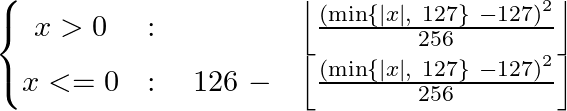
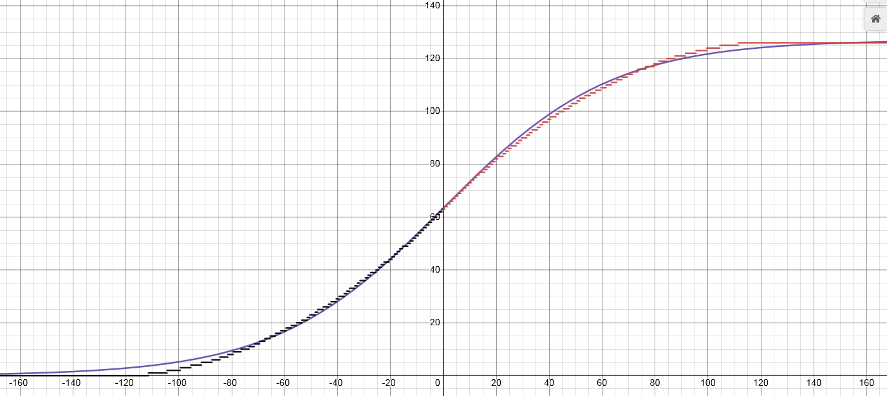

### 什么是NNUE？

NNUE就像一位厨师，他在为客人准备美食。这位厨师有一个特殊的技能，能够在短时间内准备出美味的菜肴，同时保持高质量。这就是NNUE的神奇之处。

NNUE是一种神经网络结构，就像菜肴的食谱一样。它的特点是能够快速地找到最佳的评估方法。NNUE的原则就像是这位厨师的独特烹饪技巧：

1. 厨师尽量使用较少的食材（非零输入），这样在准备菜肴时，不需要花费太多时间处理各种食材。这也使得NNUE在评估时更快速。
2. 厨师在烹饪过程中，尽量保持食材的原味（输入保持不变），这样他可以在不重新准备整道菜的情况下，快速调整菜肴的口味。这就是NNUE在评估过程中能够高效更新的原因。
3. 厨师的烹饪技巧简单易学（网络足够简单），这让他可以在普通的厨房设备上（常见硬件）轻松地展现出高水平的烹饪技艺。这使得NNUE可以在低延迟的CPU上快速评估。

虽然NNUE也适用于复杂的深度网络，但在快速的浅层网络中表现得更好。这些网络适用于低延迟的CPU推理，无需批处理和加速器。NNUE的目标性能是每秒每线程百万次评估，就像这位厨师可以在极短的时间内为客人提供百万道美食一样。这需要一种极端的解决方案，最重要的是“**量化**”技巧。

#### 关于量化101和其重要性的解读

假设厨师面前摆放着各式各样的食材（神经网络模型）。厨师的任务是将这些食材混合在一起，烹饪出一道令人垂涎的菜肴。在这个过程中，量化就像是把食材从原始的大块（浮点数）切成适合烹调的小块（整数），就好像是将食材按照合适的比例切割，以便更好地烹饪。

NNUE网络就像是一位专门训练过的快炒厨师，他擅长在热锅中迅速翻炒int8/int16（一种表示整数的计算机语言），以获取最佳的味道和效率。在这里，浮点数就像是那种需要精细切割和慢慢烹调的食材，虽然可以带来更丰富的口感，但也会花费更多的时间。虽然有些厨师会选择使用浮点数（因为它们似乎更加直观和方便），但在追求效率和速度的厨房中，整数可能是更合适的选择。

然而，在切割食材（量化）的过程中，可能会损失一些食材的原始味道（误差）。当烹饪的步骤多、层次复杂时，这些微小的味道差异可能会在最后的菜肴中显现出来。但在NNUE网络这种速度和效率至上的厨房中，这些微小的味道差异几乎可以忽略不计。

在接下来的文档中，我们会更详细地介绍量化这个烹饪技巧。在这之前，我们会继续使用浮点数这种原始大块食材，直到实际开始烹调（代码优化）时，才会切割成整数。希望通过这段描述，厨师能对NNUE的烹饪目标有所理解，因为这是塑造NNUE模型并决定其性能上限的关键因素。

#### NNUE中哪些层级是有用的？

NNUE就像是一位厨师，他擅长在有限的资源和简单的工具下制作美味的菜肴。在这个厨房里，有些层级特别适合这位厨师，就像是他的得力助手。

首先，线性层就像是厨师手中的砧板和刀，它们可以通过简单的乘法和加法来处理食材。接下来，ClippedReLU层就像是厨师用来控制调料味道的秤，确保味道不会过重或过淡，将数值限制在0和1之间。

虽然池化层和更复杂的激活函数（如sigmoid）也可以帮助厨师，但它们并不是厨师的首选工具。这就好比有时候厨师会用到搅拌器或者调味瓶，但它们并不像砧板和刀那样常用。

通常，这位厨师会设计一个简单的菜谱，只需要2-4道工序。这是因为第一道工序（第一层）已经包含了大部分所需的知识，就像是在烹饪过程中处理好食材的关键。在第一道工序之后，厨师需要逐渐减少每个步骤的复杂性（即神经元数量），以保持高效。

如果厨师在菜谱的后面增加了太多复杂的步骤，那么整道菜的味道可能会被第一道工序的影响所主导。为了保持菜肴的美味，厨师需要在后面的步骤中降低复杂性。所以，NNUE这位厨师会选择简单而高效的层级和工具，来制作出美味可口的菜肴。

#### 线性层

想象厨师正在制作一个特殊的汤，线性层（也被称为全连接层）就像是厨师的食谱。食谱会告诉厨师要使用哪些食材（输入）和他们的数量，然后烹饪出美味的汤（输出）。在这个过程中，`y = Ax+b`就是食谱的内容。

其中，`x`就像是厨师手头的食材清单，`A`是厨师的食谱中所列出的每种食材应该使用多少，`b`是一些额外的调料用来提升味道，最后得出的`y`就是厨师煮好的汤。

#### 线性层处理稀疏输入

我们在食谱中，如果某种食材（在`x`中）没有（也就是数量为零），那么我们就会跳过这个步骤。这就好像是在我们的大表格中（`A`，权重矩阵），直接跳过了整列。这就是为什么我们说线性层能有效处理稀疏输入，因为我们只需要处理那些我们实际使用的食材（也就是输入中非零的部分）。尽管我们的食谱可能包含了上千种食材，但是我们只需要关心那些我们真正要使用的。这也就是为什么第一层可以如此庞大的原因，因为它只处理那些我们真正需要的信息。

#### Clipped ReLU 层

Clipped ReLU层可以被看作是一个担任“过滤器”角色的厨师。这个厨师会按照`y = min(max(x, 0), 1)`的规则去检查烹饪中的每个元素。在这个规则下，所有的负值都会被视为0，所有大于1的值也会被减少到1。

这个过滤器厨师为我们的菜肴添加了一些非线性元素。如果我们的厨房中只有线性层，那么这些层就可以被合并成一个单独的层，因为厨师可以直接把所有的食材混合在一起。然而，加入了非线性的过滤器厨师（ClippedReLU）后，我们就可以更精细地调整我们的菜肴。

理想情况下，我们更倾向于使用普通的ReLU，但是为了做到强力量化，我们需要限制隐藏层输入的范围，所以限制值的上限为1就显得非常重要。

#### Sigmoid

我们可以把Sigmoid函数想象成一个非常专业的厨师，他精心调整食材的口感，就像用`y = 1/(1+e^-kx)`调整神经网络中的数据，其中k是调整口感或者说曲线“拉伸”程度的“调料”。

对比Clipped ReLU，我们的sigmoid厨师有两个独特的特质：

1. sigmoid厨师的烹饪方法是极度细致的，它在任何时间都可以精确调整食材的味道，但这个特质可能导致一个问题，也就是我们通常所说的“梯度消失”。厨师可以把它想象成这样：这位厨师在调味的时候，如果用的是非常细的勺子，那么他要想在菜里添加一些盐或者糖，可能需要添加很多次，这就好比网络训练时的梯度下降非常慢。在深度神经网络中，这可能导致信息传递不足，或者说“味道”无法完全渗透到每一层网络，我们称之为“梯度消失”。
2. sigmoid厨师烹饪出的菜肴的味道接近0或1，但绝不会完全达到这两个极端。这就像他烹饪的菜，味道永远不会过于极端，但总是接近某个特定的味道，使人回味无穷。

虽然这个厨师的精致技艺使得神经网络能学到比ReLU更深层次的知识，但他的效率却不高，他可能需要花费更多的时间来完善菜品的味道，这就是为什么在需要快速、粗犷的处理中（比如整数计算），我们可能更倾向于使用其他厨师，比如ReLU。然而，他的存在无疑是寻找更好的烹饪技巧的重要起点...

#### Quantmoid4

由于sigmoid厨师的效率较低，我们需要寻找替代方案。一种替代方案是使用近似的方法。恰好，`sigmoid(4x)`（以特定方式缩放到整数领域）可以被一个简单的分段二次函数很好地近似，这个函数只需要加法、乘法和位移运算。

这个替代方案的特点在于它的输出值范围在`[0, 126]`（并相应地缩放输入）。我们选择126作为上限，因为这是最大的偶数8位整数，我们希望得到一个偶数，以便在`x=0`时，值恰好在中间。其公式如下：

厨师会注意到，无论`x`是正还是负，方程都差不多。这种相似性允许我们即使存在两种情况，也能实现无分支的处理方式。

它的结果图形如下（并与缩放的sigmoid(4x)进行了比较）：

这个替代方案的缺点是它失去了平滑性，并且输出很早就四舍五入到0/1。但实际上，这并不是问题，这种"四舍五入"的实际误差可以忽略不计。

一旦我们实现和优化了这个方法，将会有更多有趣的事情发生，所以我们将在优化的量化实现部分再回到这个话题。

#### 池化层

厨师手里有一堆食材（神经元或输入），但是厨房（网络层）空间有限。怎么办？可以利用池化层来优化厨房空间，这就像是一种"缩减计划"。举个例子，这就像把大量的食材（512个输入）变成少量的菜肴（16个输出），而不是把很多的食材（1024个输入）变成很窄的菜肴（8个输出）。

这就像是厨师在做菜时挑选食材，厨师只会选择每种食材最好的部分（最大池化），或者取食材的平均价值（平均池化），或者把两种食材混合在一起（乘积池化）。这就是池化层的工作方式，它能帮厨师优化厨房空间。

### 一个简单的NNUE网络

想象厨师是一位厨师，厨师的手头有768种不同的食材，这就像我们的"A"特征集。厨师的目标是制作一道最好的菜，也就是我们的神经网络。

首先，厨师把这些食材通过一个包含3个步骤的烹饪过程。这就像我们的3个线性层，768->8, 8->8, 8->1。每一步，都是一道菜的部分步骤，而且每一步都是线性的，就像按照菜谱一步步烹饪。但在每一步之后，我们会用一种特殊的调味品ClippedReLU来给菜加点特殊的味道，这就是我们的激活函数。

这个烹饪过程就像下面这幅图：

![A[768]->8->8->1 architecture diagram](nnue_zh-cn_easy.assets/A-768-8-8-1.svg)

我们从左边开始，每个食材（输入）都被适当的处理并添加到菜中。第一步，我们有一个大型烹饪步骤，有768种食材，但在每个时间点，我们只使用一部分非零的食材 - 就像使用稀疏的食材。后续的烹饪步骤小得多，我们总是使用所有的食材。最后，我们完成了一道菜，就像我们得到1个输出，通常被训练为对应菜的口感评价（或者与之成比例）。

### 考虑网络的大小和成本

选择如何烹饪这道菜就像选择神经网络的架构一样棘手，因为这涉及到一个口感和时间的权衡。一个大型烹饪过程可能提供更美味的菜肴，但它所花费的时间可能会抵消在实际享用菜肴中带来的满足感。例如，有些厨师可能慢慢地从使用 `256x2->32->32->1` 的烹饪步骤转变为使用 `1024x2->8->32->1` 的烹饪步骤。

#### 特征集

厨师可能听说过，一个好的厨师应该深谙食材的品性，并利用复杂的技术将其烹饪得美味。然而，想想看，如果简单的菜谱也能做出美味佳肴，何乐而不为呢？HalfKP，稍后我会详细解释，就像那种简单、快速又美味的菜谱。试过更复杂的配菜，但它们通常会让整道菜的口感下降。HalfKP是那种易于处理的食材，无论怎么烹饪都不会影响整道菜的美味。

量化问题就像厨房空间的大小。对于`256x2->32->32->1`的菜谱来说，HalfKP的配料在第一步需要大约1000万个参数，也就是20MB的厨房空间。对于某些特大型厨房来说，拥有可能有数亿个参数的大型食材可能并不是问题，但对于家常厨房来说，这显然是不方便的。此外，增加配菜的种类和数量可能会降低烹饪的速度，并且肯定需要更长的时间来熬煮。

#### 第一组隐藏神经元

菜谱的第一步是最关键的，它决定了整道菜的口感和份量。成本与此参数有两个关联。首先，它增加了搅拌调料的动作数。其次，对于精细烹饪，必须考虑厨房工具的数量 - 超过256个食材就需要多次查看菜谱，因为我们的"工具箱"装不下这么多工具。这也部分决定了第一步骤的食材量，这也是整道菜的重要组成部分。

#### 后续层

与传统的烹饪流程不同，在这里，大部分的美味来源于第一步骤，因此在烹饪的后续步骤中添加更多小步骤对于提高菜品的美味性没有太大的帮助，如果采用量化，由于误差的累积，甚至可能让菜品变得口感不佳。NNUE菜谱被保持得非常简洁，保持后续步骤的简单可以提高烹饪的效率。

### 累加器

想象一位厨师在准备一道需要众多食材的复杂菜肴。这位厨师（即我们的神经网络）根据特别的食谱（即我们的权重矩阵）将各种食材混合在一起。但每次做菜都要从零开始，即便许多食材跟上次烹饪时用的一样，他还是要重新准备和混合，这显然很费时费力。这就是我们当前面对的问题。

聪明的厨师想出了解决方案：使用一个“存储罐”。这个存储罐（我们的隐藏神经元）会保留已经混合好的食材，下次做菜时，只需要根据需求调整一些食材，而不是从头开始混合。如果有些食材不再需要（如：他要做素食，不再需要鸡肉），那他就从存储罐中移除这个食材；如果需要添加新的食材（如：他要做荤菜，需要添加鸡肉），那他就把新食材加入到存储罐中。这种方式极大地减轻了每次做菜的工作量。

但厨师在使用存储罐的方法时必须小心。假设他使用一个非常精确的秤来测量食材的重量，这个秤以浮点数（能表示非常大或非常小数值的计算机数据类型）为单位。如果他每次烹饪时都反复调整秤上的食材，秤的误差就会慢慢累积。因此，他需要细心掌握这个误差，确保尽管秤有误差，但做出的菜肴的口感仍然良好。

幸运的是，厨师找到了一个解决方案：他不会每次做菜都重新调整秤的读数。相反，他会记录每次烹饪前秤的读数，然后在需要时查阅。这样，尽管有误差，但误差的累积会被限制在一定范围内，可忽略不计。

然而，如果厨师开始使用一个量化秤（即只能测量整数的秤），他就不再需要担心误差累积的问题。但他可能会面临另一个问题，即溢出问题。想象一下，厨师他可以向存储罐中添加或移除食材。使用量化秤时，加入的食材总量不可能超过这个存储罐的容量。这就像是，存储罐有可能会溢出，如果加入的食材过多（这就是我们在计算机中称之为“溢出”的概念）。这意味着，厨师在选择食材的时候必须小心，确保任何可能需要的食材组合都不会让存储罐溢出。也就是说，他需要选择一种能够确保存储罐永远不会溢出的量化方案。

总的来说，这就是我们在神经网络中如何使用这种“存储罐”（累加器）来简化计算并提高效率的。虽然我们需要考虑一些问题，比如误差的累积和溢出的风险，但是通过适当的设计和策略，我们可以成功地避免这些问题，并充分利用“存储罐”带来的优势。

### HalfKP

厨师正在准备一款美味的菜肴，这道菜就是我们的NNUE模型。半KP(HalfKP)就像是食材清单，它是烹饪时要用的所有食材。这个清单中包括的食材正好合适，每次烹调都能轻易地抓取所需的食材。在我们的情况下，每个食材其实就是一组信息 。

#### 多视角，多个累加器

厨师在厨房里准备一个复杂的大餐，这个大餐是两位客人，分别是甲和乙，准备的。厨师需要将所有的食材（特征）在不同的碗里（累加器）混合起来。每位客人都有他自己的碗，厨师不能把他们的食材混在一起。所以，最终厨师会得到两倍的食材数量，需要做两倍的搅拌工作，而且也会产生两倍大小的碗。虽然这意味着厨师要做更多的工作，但是结果会非常值得，因为厨师能够精确地满足每位客人的口味。但这种做法也会带来一些问题，厨师需要选择合适的搅拌方式和摆放顺序，以便能够有效地进行下一步的烹饪工作。

##### 如何合并多个累加器视角？

接下来，厨师需要将这两个碗中的食材（特征）混合在一起，制作出一份饭菜（向量）。现在厨师有几种方式可以做这个。

1. **简单堆叠法**：将甲的碗（`A_w`）放在乙的碗（`A_b`）上面，像堆栈一样。这是最简单的做法。这样做的好处是，厨师总是可以很明确地知道哪个食材来自哪位客人。在这种情况下，厨师做出的菜肴总是从甲的口味开始调配的。
2. **轮流堆叠法**：这个方式就像厨师在玩一种策略游戏。如果是甲的回合，厨师就先放甲的碗，然后放乙的碗，反之亦然。这个做法的优点是，厨师可以更好地掌握做菜的节奏。厨师知道下一步是轮到哪位客人，这在厨房中是非常重要的，因为这可以大大影响厨师做菜的顺序和效果。在这种情况下，厨师做出的菜肴总是以当前客人的口味为基础进行调配的。
3. **交替堆叠法**：这个方式就像是在做一种特别的搅拌工作，厨师不是将两个碗简单地堆叠在一起，而是将它们的食材交替地放入一个新的碗中，即`A_w[0], A_b[0], A_w[1], A_b[1], ...`。这种方式在某些特别的厨房布局中可能会更有效，因为并不是所有的食材都会被用到，这种交替方式可以确保每次搅拌时，都能够均匀地获取到甲和乙的食材。例如，当厨师只需要用到部分食材进行烹饪时，这种方式可以确保厨师得到的食材包含了来自甲和乙的平等份额。

##### 对于每个视角应使用哪一组权重？

那么我们是不是应该对甲和乙的食材（特征）用同样的食谱（权重）进行烹饪呢？它们可以是一样的，但也不一定非得一样。就好像不同的厨师有不同的处理这个问题的方法一样。

1. **使用同一套食谱**：这就好比我们用同样的食谱去烹饪甲和乙的食材。但是这样就需要我们以某种方式去理解食材的状态。否则，比如说客人甲的番茄在碗A中就会产生不同的味道，而放在碗B中的客人乙的茄子也会有不同的味道，而客人甲的茄子在碗C中会和客人乙的茄子在碗C中产生相同的味道，这就不好了。解决的方法是对乙的食材进行一些调整，比如改变它的位置，或者改变它的颜色，这样无论是甲还是乙，食材放到食谱中都会产生合理的味道。以甲的角度来看，碗A中的客人甲茄子应该和以乙的角度看碗B中的客人乙茄子是一样的。厨师可能会想，变换食材是一种办法。
2. **使用不同的食谱**：客人甲的茄子在碗A中真的和客人乙的茄子在碗B中一样吗？其他食材呢？就像一个人作为主厨和副厨做菜的方式可能会不一样，所以，使用不同的食谱来烹饪不同视角的食材是有道理的。这就是一些厨师的做法，并没有什么问题。唯一的缺点就是需要更多的食谱，烹饪的时间可能会稍微长一点，但除此之外，这种方法甚至可能会更好！这种方法也完全避免了关于食材变换的讨论，使得烹饪过程更加简单。

#### HalfKP  示例和网络图

假设我们现在有一个厨房，这个厨房里有一块非常大的砧板，上面可以放40960种不同的食材组合。这就像我们的HalfKP特性集。

在这个例子中，我们的网络就像是一个菜单，这个菜单上的每一道菜都是由一系列步骤来制作的。首先，我们从砧板上选取四个食材，然后我们进行两轮烹饪，每轮烹饪都有8个步骤，最后我们得到了一道菜。所以，我们的菜单可以写成 `HalfKP[40960]->4x2->8->1`。

现在让我们来看一个具体的例子。假设我们现在要为两位客人做菜，一位喜欢吃客人甲喜欢的食物，另一位喜欢吃客人乙喜欢的食物。我们的食材包括客人甲的馒头和客人乙的豆瓣酱。

我们的食材（特性）是根据客人在餐桌上的位置以及他们喜欢的食物来确定的。我们有两个视角，一个是客人甲的视角，另一个是客人乙的视角。

- 对于客人甲的视角，我们选取的食材是 `(A1, C3, 馒头, 客人甲)` 和 `(A1, D4, 豆瓣酱, 客人乙)`。
- 对于客人乙的视角，我们选取的食材是 `(B1, C6, 豆瓣酱, 客人乙)` 和 `(B1, D5, 馒头, 客人甲)`。

在这个过程中，我们做了一些技巧性的调整。例如，我们会翻转餐桌，让客人乙的客人坐在原来客人甲客人的位置，然后反过来，让客人甲的客人坐在原来客人乙客人的位置。我们也会转换食材，让馒头变成客人乙的，豆瓣酱变成客人甲的。

这样做的好处是，无论是客人甲的视角还是客人乙的视角，我们都可以使用同一种菜谱（网络）来烹饪食物。我们不需要根据客人的位置或者食材的颜色来改变我们的烹饪方式，我们只需要将食材放在一起，按照菜谱上的步骤一步一步来就可以了。

就像厨师在这个网络图上看到的那样：

![HalfKP[40960]->4x2->8->1](nnue_zh-cn_easy.assets/HalfKP-40960-4x2-8-1.svg)

在这个图中，厨师可以看到，我们从砧板上选择了四份食材，然后分成两组进行烹饪。每一组都有8个步骤，最后得到了一道菜。

厨师也许会想，既然有两个视角，那么我们是不是需要做两次菜呢？其实不是的。在我们的方法中，无论是客人甲的视角还是客人乙的视角，我们都只需要做一次菜就可以了。这是因为我们的菜谱（网络）是对称的，只要我们翻转餐桌和食材的颜色，就可以从客人甲的视角变为客人乙的视角，反之亦然。所以，无论是甲还是乙，我们都可以使用同一种方法来烹饪食物。

## 前向传播实现

想象一下，厨师是一位厨师，正在准备一道复杂的菜肴，这道菜肴包含多个步骤，并且在每一步都需要调整食材的味道。这个过程就类似于神经网络的前向传播。

### 示例网络

这个菜谱是怎样的呢？

1. 首先，厨师得到了N种食材（特征），并将其转换成M种不同的口味，这就像是将食材经过初步处理。这就是网络的第一层，我们可以把它看作是`L_0`，它是一个线性变换，将N种食材转变成M种口味。
2. 接下来，厨师开始烹饪这些口味，但厨师有个原则，那就是口味不能过于浓烈或者过于淡薄，所以厨师设置了一个上下限。这就像是`C_0`层，我们可以将其看作是一种"截断ReLU"激活函数，它将口味控制在一个适中的范围内，防止其过于极端。
3. 然后，厨师开始将这些口味组合在一起，创造出K种新的口味组合。这就是`L_1`层，它是一个线性变换，将`M*2`种口味转换为`K`种口味组合。
4. 厨师再次控制这些新口味组合的范围，防止过于极端。这就是`C_1`层，它和`C_0`层一样，都是"截断ReLU"激活函数，负责控制口味的范围。
5. 最后，厨师开始将这些口味组合进行最后的烹饪，创造出最后的菜肴，这就是`L_2`层，它是一个线性变换，将`K`种口味组合转换为一道菜肴。

### 层参数

每个烹饪步骤（线性层）都需要一些调料，也就是参数。这些参数包括权重和偏置，我们可以把它们看作是调料的种类和数量。比如，`L_0.weight`可以看作是在第一步烹饪时用到的各种调料，`L_0.bias`可以看作是用来调整口味的特殊配料。

此外，厨师还需要知道每个步骤开始时的食材种类和数量，也就是`L_0.num_inputs`，以及烹饪结束后的口味种类和数量，也就是`L_0.num_outputs`。

考虑烹饪步骤的顺序和方式就像理解权重矩阵的布局。如果厨师想把某一种调料（权重）用在特定的食材（输入特征）上，厨师需要知道这种调料在厨师的调料架（权重矩阵）上的位置。这里有两种可能的方式，就好像厨师可以根据调料的种类或者颜色来整理厨师的调料架一样。我们可以将它们看作是列优先和行优先的布局方式。

1. 列优先布局，就像厨师先决定使用哪一种调料，然后再选择具体要放在哪些食材上。在稀疏乘法中，这种方式更有利，因为我们只需要对特定的食材（输入特征）添加调料（权重）。
2. 行优先布局，就像厨师先决定烹饪哪一种食材，然后再从厨师的调料架上选择相应的调料。这种方式在密集乘法中可能会更好，因为厨师可能会同时处理多种食材。

当前我们正在使用的是列优先布局，就好像我们一次选择一个调料，然后决定将它添加到哪些食材上。这种方式可以让我们通过`L_0.weight[column_index][row_index]`来查找每个调料。但是，在后续的量化和优化过程中，我们可能会重新考虑使用行优先布局。

现在的示例代码就像是一份菜谱，虽然可能略显简化，但是已经包含了准备这道菜所需要的所有步骤和调料。

### 累加器

想象一下，累加器就像是厨师用来做菜的一张食谱。这张食谱上有一个列表，用来记录厨师在制作美食时需要关注的两种视角：甲视角和乙视角。这就像是在烹饪时，需要考虑到食材的口感和颜色搭配等多方面的因素。

累加器在评估过程中可以选择灵活地更新，就像是厨师在制作菜肴时可以随时调整食谱。累加器的更新有两种情况：

1. 重新计算累加器：这就像是厨师在制作新的菜肴时，需要重新审视食谱，重新计算所需的食材和步骤。
2. 重复使用先前的累加器，并仅更新更改的特征：这就像是厨师在制作类似的菜肴时，只需要调整其中的一些食材和步骤，而不需要完全重新开始。

总之，累加器就像是厨师手中的一张食谱，可以帮助他在制作美食时，灵活地调整和更新所需的食材和步骤。这样，厨师就能根据不同的需求，快速地为客人（用户）提供美味的菜肴。

### 线性层

线性层就像是厨师在做菜时进行的一道关键步骤，那就是混合调料。这个过程看似简单，但实际上在优化时会变得复杂。现在让我们一起详细了解这道步骤。

首先，厨师会准备一个调料碗（已分配的存储空间），然后将基本的调料（偏置）放入碗中。接下来，厨师会根据食谱（权重矩阵）逐个添加其他调料（输入值），并将它们混合在一起。这个过程就像是彩虹图中的颜色混合，最后形成一个调好味道的菜肴。

在这个过程中，厨师会按照食谱的顺序逐列添加调料（权重），并通过输入值（前一个ClippedReLU层的输出）进行缩放。最后，厨师会告诉客人（调用者）这道菜已经调好味道，可以品尝了（返回缓冲区的结束位置）。

## 使用PyTorch训练网络

想象一下，我们的厨师（NNUE）需要学习如何制作一道新菜。为了做到这一点，他需要跟随一个菜谱（训练网络）。这次，我们将使用PyTorch这个厨师助手来帮助他学习。

首先，我们需要了解一下厨师助手的特性。PyTorch可以自动处理一些基本任务，例如线性层。这就像是助手可以自己处理切菜、搅拌等基本步骤。我们只需要告诉助手我们的菜谱（模型架构）。

但是，为了让助手真正发挥作用，我们需要准备好食材（输入数据）。这里有两个关键步骤：解析训练数据集并将其传递到Python端。想象一下，我们需要将食材从市场（训练数据集）带回厨房（Python环境）。

我们不能简单地将食材一个个送到厨房，因为这样太慢了。相反，我们需要一个更快的方法。我们可以使用C++这个助手来帮助我们快速地将食材从市场运到厨房。这就像是我们雇佣了一个专门的送货员，他可以快速地将食材送到厨房。

为了让C++助手和Python助手（PyTorch）一起工作，我们需要使用一种特殊的方法，例如Ctypes，让它们互相传递信息。这就像是我们需要一个翻译员来帮助两个助手互相理解。

最后，我们需要将食材准备成适当的形式，以便助手可以轻松地处理。由于我们的食材是稀疏的，我们需要将它们整理成一个大的2D稀疏输入张量。这就像是我们将食材切成合适的大小，以便助手可以轻松地将它们放入锅里烹饪。

总之，我们需要使用PyTorch这个厨师助手来帮助NNUE厨师学习新菜谱。为此，我们需要解析训练数据集，将其传递到Python环境，并将其准备成适当的形式。通过这种方式，我们的厨师（NNUE）可以在学习新菜谱时变得更加高效。

### 特征分解

想象一下，厨师NNUE正在制作一道复杂的菜肴，需要使用不同的食材（特征）。这次，厨师将关注`HalfKP`特征集，并尝试理解其中的食材如何相互关联。

为了让网络了解这些食材（特征）之间的关系，厨师决定引入虚拟特征。他将两种特征集合并，从40960个`HalfKP`特征和640个`P`特征扩展到40960+640个特征。

现在，厨师可以更好地理解这些食材之间的联系。但在实际烹饪过程中，使用所有这些特征可能会让厨师手忙脚乱，而且成本过高。既然厨师已经知道哪些特征是相关的，他可以在开始烹饪之前，以某种方式将它们合并，从而使烹饪过程更加高效。

这样，NNUE厨师就可以在保持高效的同时，更好地理解和利用这些特征（食材）之间的关系，从而制作出更美味的菜肴（评估结果）。

#### 真实效果的因素化

厨师NNUE在制作一道菜肴时，发现一种技巧（因素化）在烹饪的早期阶段非常有用。这个技巧能够加速烹饪过程并提高食材的利用率。然而，随着烹饪过程的进行，这个技巧变得不那么重要了。所以，在后期阶段，厨师可以放弃这个技巧，专注于其他更重要的事情，以提高烹饪速度。

#### 损失函数及其应用方法

训练NNUE网络就像是寻找制作一道完美菜肴的最佳方法。为了实现这个目标，厨师需要找到一种方法来衡量他的烹饪技巧，这就是损失函数。损失函数应该足够平滑，并在最佳评估（训练目标）处取得最小值。对于NNUE来说，这个目标可以通过梯度下降和常规的机器学习方法来实现。

#### 在评估中使用对局结果

现在，厨师可以将他的烹饪技巧与实际对局结果进行比较。通过引入一个插值参数，厨师可以在模型评估值和对局结果之间进行权衡。这种方法可以帮助厨师找到最佳的烹饪技巧，从而制作出最美味的菜肴。

总之，NNUE厨师通过优化损失函数、在不同空间中进行评估和利用对局结果，不断改进自己的烹饪技巧，以便为客人提供最美味的菜肴。哪种方法更有效则取决于具体情况。

#### 均方误差（MSE）

想象NNUE厨师正在制作一道复杂的菜肴，需要对食材（特征）进行精确的拟合。为了做到这一点，厨师使用了几种不同的烹饪技巧，分别是均方误差（MSE）、交叉熵（Cross entropy）和量化（Quantization）。

均方误差就像是厨师用来衡量食材差异的尺子，通过计算预测值和目标值之间的差的平方，以获得一个良好的线性梯度。

#### 交叉熵（Cross entropy）

交叉熵则是厨师用来处理连续分类问题的技巧。在这个过程中，厨师需要注意处理边界问题，避免在对数运算中出现0，通常会添加一个非常小的值（epsilon）。

## 量化（Quantization）

量化是厨师用来在有限的资源下制作美味佳肴的关键技巧。厨师希望使用尽可能小的整数，从而充分利用CPU的处理能力。为了实现这一目标，厨师需要设计合适的量化方案，包括特征转换器、线性层和ClippedReLU层的处理。

厨师会通过一系列数学运算和技巧来调整权重、偏置和激活范围，从而实现量化。这样，NNUE厨师可以在保持高效的同时，更好地拟合食材（特征），从而制作出更美味的菜肴（评估结果）。

### Stockfish的量化方案

#### 特征转换器

首先，厨师需要处理特征转换器。回想一下，这个部分的目标是将激活范围从0到1调整为0到127。由于特征转换器只涉及加法，厨师只需要将权重和偏置乘以127。这样，厨师就可以在保持高精度的同时，将激活范围调整为所需的范围。

#### 线性层

接下来，厨师处理线性层。在这里，厨师希望使用int8输入，同时保持较高的精度。为了实现这个目标，厨师需要应用一个缩放因子。这个缩放因子取决于需要保留多少精度，但不能太大，以免限制权重的幅度。例如，在Stockfish中，缩放因子为64，这意味着浮点空间中的最大权重为127/64=1.984375。这足以获得一个良好的网络，但在训练过程中需要注意限制权重，使其不超出该范围。

#### ClippedReLU

在这一部分，厨师没有特别的操作。由于输入没有被缩放，这只是在不同的域中执行相同的操作。与将值夹在0到1之间不同，我们将其夹在0到127之间。

### 量化的数学原理和如何使其适应

为了量化网络，厨师需要将权重和偏置乘以一个常数，将它们转换为不同范围的值。在网络推断过程中，这会导致乘法问题。然而，每个层仍然是独立的，因此厨师可以逐层处理。

#### 特征转换器

厨师需要将激活范围从0到1调整为0到127。由于特征转换器只涉及加法，厨师只需要将权重和偏置乘以127。这样，厨师就可以在保持高精度的同时，将激活范围调整为所需的范围。

#### 线性层

在这里，厨师需要应用一个缩放因子，以便在保持较高精度的同时使用int8输入。这个缩放因子取决于需要保留多少精度，但不能太大，以免限制权重的幅度。

通过逐层处理和应用适当的缩放因子，厨师NNUE能够在保持高精度的同时，实现网络的量化。这样，厨师就可以为客人（用户）提供精确且美味的菜肴（评估结果）。
